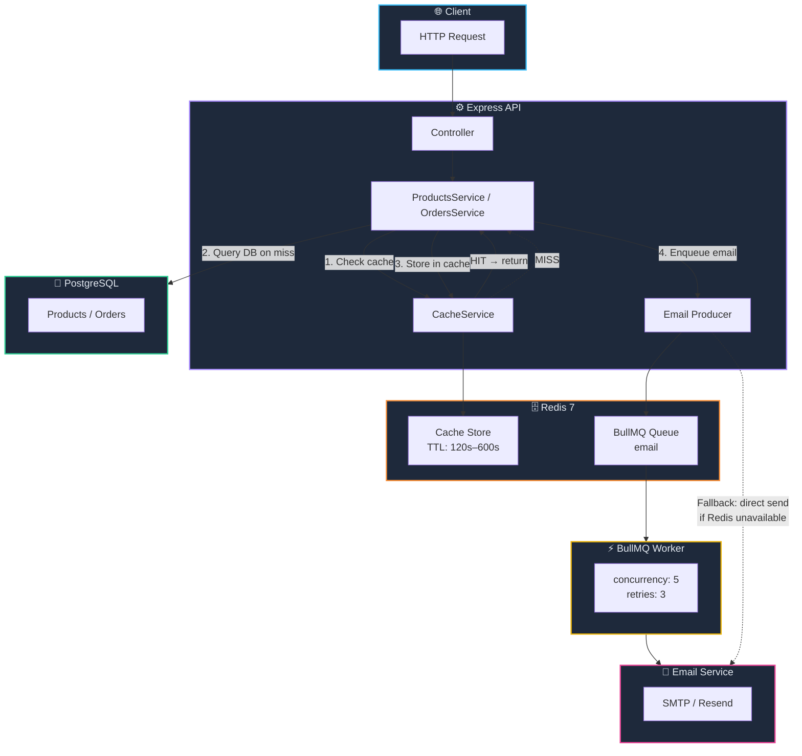

# 005. 🗄️ Optional Redis for Product Caching and BullMQ Email Queue

**Status**: Accepted
**Date**: 2026-03-14
**Deciders**: Engineering team

## Context

Two recurring performance and reliability concerns motivated this decision:

1. **Product catalog queries hit PostgreSQL on every request.** The product listing, detail, featured, and filter endpoints serve read-heavy traffic. The underlying data changes infrequently (only when an admin creates, updates, or deletes a product), yet every request executes a full database query. As traffic grows, this puts unnecessary load on PostgreSQL.

2. **Order confirmation emails block the HTTP response.** When a customer completes an order, the confirmation email is sent synchronously inside the request lifecycle. If the email provider is slow or temporarily unavailable, the customer experiences a delayed or failed response, even though the order itself was committed to the database successfully.

Both problems share a common infrastructure dependency: a message broker or cache store. Redis is the natural fit because it serves both roles (cache and BullMQ transport) with a single deployment.

### Constraint: Redis Must Be Optional

Not every deployment needs Redis. Local development, small self-hosted instances, and test environments should work without provisioning a Redis server. The application must degrade gracefully when `REDIS_URL` is not set.

### Alternatives Evaluated

#### Caching

| Approach | Verdict | Reasoning |
|----------|---------|-----------|
| **Redis (cache-aside)** | Selected | Shared cache that survives process restarts. Supports TTL-based expiration and pattern-based invalidation. The ioredis client provides a mature, well-tested connection to Redis |
| **In-process LRU cache** (e.g., `lru-cache`) | Rejected | Does not share state across multiple server instances. Each process maintains its own cache, leading to inconsistent responses after a product update until every process cache expires |
| **CDN / reverse proxy caching** | Rejected for now | Appropriate for public-facing deployments behind Cloudflare or nginx, but does not help during local development or staging. Can be layered on top of Redis caching later |
| **PostgreSQL materialized views** | Rejected | Adds schema complexity and requires explicit refresh calls. Redis provides the same benefit with less coupling to the database layer |

#### Email Queue

| Approach | Verdict | Reasoning |
|----------|---------|-----------|
| **BullMQ (Redis-backed)** | Selected | Persistent job queue with retry, exponential backoff, concurrency control, and dead-letter semantics. Shares the same Redis instance as the cache |
| **Database-backed job queue** (e.g., `pg-boss`) | Rejected | Avoids the Redis dependency but adds polling load to PostgreSQL. For a single job type (order confirmation emails), the operational overhead is not justified |
| **In-process queue** (`setTimeout`, event emitter) | Rejected | Jobs are lost on process restart. Not acceptable for transactional emails |
| **External message broker** (RabbitMQ, Amazon SQS) | Rejected | Introduces a heavier infrastructure dependency for a single job type. BullMQ on Redis is sufficient and keeps the stack simple |

## Decision

We add Redis as an **optional** infrastructure dependency. When `REDIS_URL` is configured, the application activates two features:

### 1. Product Cache (CacheService)

The `CacheService` wraps ioredis with a simple get/set/delete interface. All keys are prefixed with `blessp:` to prevent collisions in shared Redis instances.

| Cached Data | Cache Key Pattern | TTL |
|-------------|-------------------|-----|
| Product listing (paginated, filtered) | `products:list:<queryHash>` | 120 seconds |
| Single product detail | `products:detail:<id>` | 300 seconds |
| Featured products | `products:featured` | 300 seconds |
| Product filters (categories, etc.) | `products:filters` | 600 seconds |

**Invalidation strategy:** On any product create, update, or delete, all keys matching `products:*` are invalidated via `SCAN` + `DEL`. This is a conservative approach that prioritises correctness over cache hit rate. Given that product mutations are infrequent (admin-only operations), the trade-off is acceptable.

**No Redis?** When `REDIS_URL` is unset, `getRedisClient()` returns `null`. The `CacheService` checks for a null client on every operation and returns immediately (no-op). All reads fall through to PostgreSQL. No errors are raised and no retry logic is triggered.

### 2. BullMQ Email Queue

Order confirmation emails are dispatched through a BullMQ queue named `email`.

| Property | Value |
|----------|-------|
| Queue name | `email` |
| Job type | `order-confirmation` |
| Idempotency key | `orderId` (prevents duplicate emails for the same order) |
| Retry policy | 3 attempts with exponential backoff (5s, 10s, 20s) |
| Worker concurrency | 5 |
| Completed job retention | 1,000 most recent |
| Failed job retention | 5,000 most recent |

**Fallback behaviour:** When Redis is unavailable, `getEmailQueue()` returns `null`. The producer (`enqueueOrderConfirmationEmail`) detects this and sends the email synchronously in the current request. A warning is logged. The customer still receives their confirmation, but the HTTP response may be slower.

### ioredis Client Configuration

The Redis client uses `lazyConnect: true` so the application starts without blocking on a Redis connection. `maxRetriesPerRequest: null` is required by BullMQ to prevent premature request failures during transient Redis outages.

```typescript
new Redis(Env.REDIS_URL, {
  maxRetriesPerRequest: null,
  enableReadyCheck: true,
  lazyConnect: true,
});
```

Connection errors are logged at `warn` level. They do not crash the process or trigger alerts unless sustained.

### Architecture Diagram



### Graceful Shutdown

The shutdown sequence (in `server.ts`) closes resources in order:

1. Stop the BullMQ email worker (drain in-progress jobs)
2. Close the BullMQ email queue
3. Disconnect from Redis
4. Disconnect from PostgreSQL

### Docker Compose

Both `docker-compose.yml` and `docker-compose.dev.yml` include a `redis:7-alpine` service with a persistent volume (`redisdata`) and a health check (`redis-cli ping`). The app service depends on Redis with `condition: service_healthy`.

## Consequences

### What becomes easier

- **Reduced database load for product reads.** Cached responses avoid repeated queries for data that changes infrequently. The 120s to 600s TTLs provide a good balance between freshness and hit rate
- **Faster order creation responses.** Offloading email delivery to a background worker removes the email provider's latency from the customer-facing request path
- **Reliable email delivery.** BullMQ retries failed jobs automatically. The dead-letter queue captures persistent failures for manual investigation
- **Zero-configuration local development.** Developers who do not set `REDIS_URL` experience no difference in functionality, only in performance

### What becomes harder

- **One more service to operate.** Production deployments that want caching and background emails must provision and monitor a Redis instance. The Docker Compose files handle this automatically, but standalone deployments require manual setup
- **Cache invalidation correctness.** The pattern-based invalidation (`products:*`) is deliberately aggressive. If we add more granular caching in the future (e.g., per-user caches, per-category caches), we will need to revisit the invalidation strategy
- **Debugging email delivery.** When emails are queued asynchronously, failures are not visible in the HTTP response. Operators must check the BullMQ dead-letter queue or application logs to diagnose email delivery problems
- **Two code paths for email sending.** The synchronous fallback adds a branch that must be tested independently. Both paths are covered in the test suite

### Future Considerations

- **Rate limiting state in Redis.** The current rate limiter uses in-memory state, which does not share across multiple server instances. Moving rate limit counters to Redis would enable consistent enforcement in a horizontally scaled deployment
- **Session caching.** If we introduce server-side sessions (e.g., for CSRF tokens or WebSocket auth), Redis is the natural store
- **Additional job types.** The BullMQ infrastructure supports multiple queues. Future candidates include password reset emails, admin notification emails, and scheduled inventory reports
