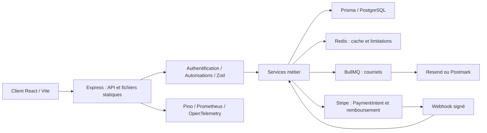

# Audit complet de BLE$$ P

> **Historique avant corrections.** Les modifications et nouvelles vérifications sont décrites dans [CORRECTIFS.md](CORRECTIFS.md). Les résultats ci-dessous concernent la révision initiale.

**Date : 16 septembre 2026. Révision auditée : `b20ad8f`. Version déclarée : 3.0.0.**

**Avis : je déconseille l’ouverture à des clients et paiements réels en l’état.** La structure du projet est exploitable et plusieurs protections sont bien présentes. Les défauts décisifs se trouvent dans les règles métier, la cohérence entre interfaces et API, et la validité des contrôles de livraison. Ils peuvent produire des stocks négatifs, des commandes impossibles à reprendre, une protection MFA contournable et des opérations financières incohérentes.

L’audit comporte **36 constats : 14 P1 et 22 P2**. P1 signifie à corriger avant ouverture publique ou avant la prochaine livraison si le site est déjà exploité ; P2 signifie correction planifiée et suivie. Ces priorités sont celles du projet ; elles ne sont pas des scores CVSS. Aucun incident réel, vol de compte réel ou double débit réel n’est affirmé.

## 1. Périmètre et méthode

Analyse du dépôt complet : architecture, 14 domaines fonctionnels de l’API, modèle PostgreSQL, migrations, client React, authentification, autorisations, Stripe, panier, stocks, coupons, fidélité, courriels, observabilité, conteneurs, CI/CD, tests, documentation, ergonomie, accessibilité, performances et engagements de confidentialité.

Le dépôt initial était propre : 362 fichiers suivis et environ 27 909 lignes dans `server/src` et `client/src`, traductions comprises. Le serveur contient 113 fichiers TypeScript. Les trois fichiers de verrouillage npm ont été examinés.

Travaux réellement exécutés :

- Lecture ciblée des contrôleurs, services, repositories, schémas, routes et parcours client ; rapprochement des contrats frontend/backend.
- Lint, compilation, tests unitaires et intégration, nouvelle mesure de couverture incluant les sources oubliées.
- PostgreSQL 16 éphémère, migrations depuis une base vide, comparaison du schéma avec Prisma, données exclusivement synthétiques.
- Reproductions via Supertest et la vraie base PostgreSQL. Pour Stripe : événements signés avec une clé de test locale et doublure de l’adaptateur lors du test de concurrence, sans débit ni appel au prestataire.
- Tests navigateur Chromium sur le build de production servi par Express, tests axe et simulations Lighthouse mobile.
- `npm audit`, Semgrep, Gitleaks sur 84 commits, construction Docker et analyse de l’image avec Trivy.
- Démarrage de l’image sous Node 22, utilisateur `appuser`, contrôle réel de `/health/ready` ; tests unitaires également exécutés dans cette image.

Les outils existants ont suffi pour les scans ; `axe-core` et Lighthouse ont été installés dans un répertoire temporaire indépendant. Aucun nouveau MCP n’était nécessaire. Aucun code applicatif, lockfile ou configuration de production n’a été corrigé pendant cet audit. Les seuls ajouts suivables sont ce dossier de rapport et ses preuves.

**Limites précises :** aucun paiement/remboursement Stripe réel, envoi de courriel, connexion réelle Google/Apple, inspection de production, restauration d’une sauvegarde réelle ou test de charge soutenu. Les contrôles locaux ne prouvent donc pas le fonctionnement des prestataires, DNS, TLS, secrets de déploiement, backups ou règles réseau en production. Les tests navigateur utilisent un port alternatif pour éviter les services déjà présents. Les conditions fiscales et réglementaires dépendent de l’entreprise et des marchés effectivement desservis.

## 2. Résultats mesurés

| Contrôle | Résultat |
|---|---|
| ESLint serveur et client | Réussi, sans avertissement |
| Compilation TypeScript et Vite en production | Réussie |
| Tests unitaires | **309/309**, 18 suites, sous Node 24.13.1 et Node 22.22.2 |
| Intégration, exécution séquentielle | **63/63**, 6 suites |
| Intégration, 2 workers et base commune | **9 échecs / 63**, 3 suites en échec |
| Couverture des lignes, configuration actuelle | **86,14 %**, seulement 34 fichiers présents dans le rapport |
| Couverture des lignes, `src` inclus dans les racines Jest | **42,40 %**, 99 fichiers instrumentables ; statements 42,87 %, branches 51,49 %, fonctions 39,03 % |
| Playwright existant, catalogue de test alimenté | **24 réussites, 12 échecs**, 36 tests, aucun ignoré |
| Migrations sur base vide | 3 appliquées ; aucun écart avec `schema.prisma` |
| Docker | Construction réussie, démarrage réussi, readiness HTTP 200, utilisateur non root |
| Semgrep | 74 règles, 199 fichiers, aucune alerte ; les défauts métier ci-dessous échappent à ce scan |
| Gitleaks | 24 occurrences historiques ; exemples de documentation et fixtures de test, aucun secret réel confirmé |
| Actionlint | Une remarque ShellCheck de style ; ne détecte pas l’erreur de référence d’image décrite plus bas |

Les tests d’intégration séquentiels ont réellement utilisé PostgreSQL. Leur réussite ne repose pas ici sur le mécanisme d’abandon silencieux quand la base est absente.

### Dépendances et image

Nombre de **paquets signalés** par `npm audit`, avec les doublons transitifs propres à cet outil :

| Périmètre | Critique | Élevé | Modéré | Faible | Total |
|---|---:|---:|---:|---:|---:|
| Racine, outils de développement | 2 | 0 | 0 | 0 | 2 |
| Serveur, toutes dépendances | 1 | 13 | 28 | 3 | 45 |
| Serveur, `--omit=dev` | 1 | 9 | 26 | 1 | 37 |
| Client, toutes dépendances | 0 | 8 | 2 | 2 | 12 |
| Client, `--omit=dev` | 0 | 2 | 0 | 0 | 2 |

Trivy trouve dans l’image construite **144 occurrences**, couvrant 91 identifiants distincts : **4 critiques, 56 élevées, 48 moyennes et 36 faibles**. Les quatre occurrences critiques concernent `libcrypto3`, `libssl3`, `protobufjs` et `tar`. Les 144 occurrences disposent d’une version corrigée selon la base du scanner au moment de l’analyse. Ce décompte n’est pas celui de 144 failles exploitables à distance dans l’application.

### Performances et interface

Mesures Lighthouse locales, un passage par page avec simulation mobile, build de production, catalogue synthétique :

| Page | Performance | Accessibilité | Bonnes pratiques | SEO | FCP | LCP | TBT | CLS |
|---|---:|---:|---:|---:|---:|---:|---:|---:|
| Accueil | 64 | 100 | 92 | 100 | 4,9 s | 7,2 s | 30 ms | 0 |
| Boutique | 63 | 94 | 92 | 100 | 5,0 s | 7,4 s | 30 ms | 0 |

Ces valeurs sont des indications de laboratoire, pas des percentiles d’utilisateurs réels. Le score SEO automatique ne valide ni l’indexation des fiches produit ni leurs aperçus sociaux.

Le bundle principal de production mesure **382,75 kB, 119,14 kB gzip**, auxquels s’ajoutent les chunks partagés et les pages. Le premier build technique sous `NODE_ENV=test` a été écarté des mesures de production.

## 3. Architecture et acquis à conserver



Les fondations sont pertinentes pour cette taille de boutique : monolithe modulaire, séparation controllers/services/repositories, TypeScript strict, validation Zod, Prisma et migrations versionnées, prix calculés côté serveur en centimes, instantanés d’adresse et de prix sur les commandes, contrôle d’appartenance de nombreuses ressources.

Autres points positifs vérifiés : Argon2id avec paramètres explicites, JWT RS256 avec algorithme imposé, cookie refresh HttpOnly/Secure en production/SameSite strict, jeton d’accès gardé en mémoire côté client, signature Stripe sur corps brut, comparaison du montant et de la devise, existence d’une table d’événements Stripe, lazy loading des pages, image multiétape non root, exclusion des `.env` du contexte Docker, runbooks et ADR.

Le principal défaut architectural est la **frontière transactionnelle** : le repository peut encapsuler une création de commande dans une transaction, alors que la consommation du coupon, le stock, le panier, l’historique et les effets annexes restent à l’extérieur. Plusieurs commentaires promettent une atomicité ou une idempotence que le code n’assure pas.

## 4. Sécurité des comptes

### SEC-01 · P1 · Un refresh token est accepté comme access token

**Preuve reproduite :** `GET /api/v1/users/profile` répond 200 avec un JWT de refresh valide placé dans `Authorization: Bearer`, même sans ligne correspondante dans `refresh_tokens`.

`verifyAccessToken()` vérifie uniquement signature et expiration, puis convertit le résultat en type TypeScript. Il n’exige ni usage du token, ni audience distincte, ni forme des claims. Les deux familles utilisent la même clé. Le refresh token porte `userId`, ce qui suffit aux routes client ; il ne fournit pas de privilège administrateur par ce seul mécanisme.

**Conséquence :** un refresh token obtenu peut être utilisé sur l’API pendant sa validité cryptographique de sept jours, indépendamment de sa rotation ou suppression en base. Cela contredit le cloisonnement et la révocation attendus.

**Correction :** audiences/usages explicites, schémas de claims vérifiés à l’exécution, séparation stricte des validateurs, tests refusant tous les tokens de refresh sur les routes métier. Sources : [server/src/core/security/token.service.ts:67](/home/vedric/projets/fullstack/blessp/server/src/core/security/token.service.ts:67) ; [server/src/core/middleware/authenticate.ts:26](/home/vedric/projets/fullstack/blessp/server/src/core/middleware/authenticate.ts:26).

### SEC-02 · P1 · MFA désactivable ou contournable par d’autres parcours

**Preuves reproduites :** sur une MFA active, `POST /auth/mfa/refuse` répond 200 et met `enabled=false` ; `POST /auth/mfa/setup` répond 201, remplace le secret et désactive la MFA sans demander le facteur actuel. Ces routes demandent seulement une session. À la frontière du service, `oauthLogin()` émet aussi des tokens pour un compte dont la MFA est activée, sans challenge.

**Conséquence :** une session volée permet de neutraliser le second facteur ; une connexion fédérée n’applique pas la politique MFA du compte. Cela ne signifie pas qu’un visiteur anonyme peut désactiver la MFA sans token préalable.

**Correction :** interdire `refuse/setup` sur une MFA déjà active sans réauthentification renforcée ; conserver un secret pending séparé ; appliquer la décision MFA à tous les modes de connexion et aux comptes administrateurs. Stocker les secrets TOTP chiffrés et rendre la consommation des codes de secours conditionnelle et atomique. [OWASP recommande de réauthentifier un changement de facteur](https://cheatsheetseries.owasp.org/cheatsheets/Multifactor_Authentication_Cheat_Sheet.html#changing-mfa-factors).

Sources : [server/src/features/auth/mfa.service.ts:125](/home/vedric/projets/fullstack/blessp/server/src/features/auth/mfa.service.ts:125) ; [server/src/features/auth/mfa.service.ts:275](/home/vedric/projets/fullstack/blessp/server/src/features/auth/mfa.service.ts:275) ; [server/src/features/auth/auth.service.ts:162](/home/vedric/projets/fullstack/blessp/server/src/features/auth/auth.service.ts:162).

**Apple :** contrairement à Google, le vérificateur ne refuse pas une configuration sans `APPLE_CLIENT_ID`. L’option `audience` devient alors absente et ne protège plus l’application destinataire du token. Rejeter ce cas avant toute vérification : [server/src/features/auth/oauth.service.ts:105](/home/vedric/projets/fullstack/blessp/server/src/features/auth/oauth.service.ts:105). Aucune connexion réelle Apple n’a été tentée.

### SEC-03 · P1 · Identité par courriel non vérifiée et liaison OAuth automatique

L’inscription crée immédiatement un compte et une session sans preuve de possession du courriel. Le service OAuth rattache automatiquement une identité externe à un compte ayant la même adresse, en conservant son mot de passe et ses sessions. C’est un scénario de préappropriation de compte : une inscription préalable avec l’adresse d’une autre personne peut subsister après la connexion OAuth de son propriétaire.

**Autre preuve HTTP :** un changement d’adresse dans `/users/profile` est immédiatement accepté sans mot de passe actuel, MFA ou vérification de la nouvelle boîte.

**Correction :** introduire `emailVerifiedAt`, vérifier l’adresse avant activation sensible, prévoir une liaison explicite et réauthentifiée des identités OAuth ; changement de courriel en attente, notifications à l’ancienne et à la nouvelle adresse, invalidation des sessions pertinente.

Sources : [server/src/features/auth/auth.service.ts:43](/home/vedric/projets/fullstack/blessp/server/src/features/auth/auth.service.ts:43) ; [server/src/features/auth/auth.service.ts:192](/home/vedric/projets/fullstack/blessp/server/src/features/auth/auth.service.ts:192) ; [server/src/features/users/users.service.ts:36](/home/vedric/projets/fullstack/blessp/server/src/features/users/users.service.ts:36).

### SEC-04 · P1 · Le lien de réinitialisation est journalisé avec son secret

`forgotPassword()` écrit `resetUrl` au niveau info. Cette URL contient le token utilisable ; le redacteur Pino ne masque pas `resetUrl`. Un lecteur des logs pourrait réinitialiser le mot de passe d’un compte concerné pendant la fenêtre de validité. Les tokens de reset sont également stockés en clair.

**Correction :** journaliser seulement l’identifiant de l’opération et du compte, stocker un hash du token, rendre son utilisation atomique et invalider les autres tokens de réinitialisation après succès. Ajouter une vérification ciblée des logs. Constats par lecture du code, aucun token réel extrait.

Sources : [server/src/features/auth/auth.service.ts:331](/home/vedric/projets/fullstack/blessp/server/src/features/auth/auth.service.ts:331) ; [server/src/core/observability/logger.ts:13](/home/vedric/projets/fullstack/blessp/server/src/core/observability/logger.ts:13) ; [server/src/features/auth/auth.repository.ts:62](/home/vedric/projets/fullstack/blessp/server/src/features/auth/auth.repository.ts:62).

### SEC-05 · P2 · Rotation concurrente, révocation et stockage des facteurs incomplets

**Preuve reproduite :** deux appels concurrents à `refreshToken()` avec le même token produisent deux renouvellements réussis. La lecture de `usedAt`, sa modification et la création du successeur ne sont pas atomiques. Les codes MFA de secours suivent également une lecture puis réécriture du tableau ; leur commentaire « atomically » n’est pas une garantie de concurrence.

`changePassword()` ne révoque pas les refresh tokens. Après suppression du compte, un access token existant accède encore au panier : réponse 200 reproduite. Le middleware ne contrôle pas `deletedAt` ni une version de session. La tolérance éventuelle jusqu’à expiration d’un access token doit être une décision explicite ; SEC-01 aggrave ici la durée possible.

Les secrets TOTP sont en clair et la durée de validité en base/cookie du refresh reste fixée à sept jours même si `JWT_REFRESH_EXPIRY` change.

**Correction :** compare-and-swap ou transaction verrouillée pour la rotation, stockage adapté des tokens, version de session/révocation pour les événements sensibles, chiffrement TOTP et durée cohérente partout.

Sources : [server/src/features/auth/auth.service.ts:260](/home/vedric/projets/fullstack/blessp/server/src/features/auth/auth.service.ts:260) ; [server/src/features/auth/mfa.service.ts:183](/home/vedric/projets/fullstack/blessp/server/src/features/auth/mfa.service.ts:183) ; [server/src/features/users/users.service.ts:55](/home/vedric/projets/fullstack/blessp/server/src/features/users/users.service.ts:55) ; [server/src/features/auth/auth.service.ts:407](/home/vedric/projets/fullstack/blessp/server/src/features/auth/auth.service.ts:407).

### SEC-06 · P2 · Le port direct permet de contourner le limiteur avec X-Forwarded-For

**Preuve reproduite hors mode test :** dix appels d’authentification donnent 422 puis le onzième 429 ; changer uniquement `X-Forwarded-For` permet un nouvel appel, réponse 422. `trust proxy = 1` suppose un proxy unique, tandis que Compose publie `3000:3000` sur toutes les interfaces.

**Condition :** ce contournement concerne un déploiement où le port applicatif est joignable directement. Un filtrage réseau externe pourrait l’empêcher ; il n’a pas été inspecté.

**Correction :** lier le port à loopback ou au réseau privé du proxy, définir précisément les proxys de confiance, et ajouter une limite par compte pour la connexion/MFA. [Express documente cette dépendance à la topologie réseau](https://expressjs.com/en/guide/behind-proxies/).

Sources : [server/src/app.ts:24](/home/vedric/projets/fullstack/blessp/server/src/app.ts:24) ; [docker-compose.yml:41](/home/vedric/projets/fullstack/blessp/docker-compose.yml:41) ; [server/src/core/middleware/rate.limit.ts:60](/home/vedric/projets/fullstack/blessp/server/src/core/middleware/rate.limit.ts:60).

### SEC-07 · P2 · HTML utilisateur interpolé dans les courriels

Nom, sujet, message de contact, nom client et certaines variantes sont directement incorporés aux templates HTML. Un message peut donc modifier la mise en forme et introduire des liens ou contenus trompeurs dans un courriel envoyé par la boutique. Une exécution JavaScript dans le lecteur de courriel n’est pas démontrée et n’est pas nécessaire à cet impact.

**Correction :** échappement HTML systématique des données textuelles, templates avec autoéchappement et liens générés depuis des valeurs autorisées.

Sources : [server/src/features/contact/contact.service.ts:26](/home/vedric/projets/fullstack/blessp/server/src/features/contact/contact.service.ts:26) ; [server/src/features/auth/auth.emails.ts:46](/home/vedric/projets/fullstack/blessp/server/src/features/auth/auth.emails.ts:46) ; [server/src/features/orders/order.emails.ts:32](/home/vedric/projets/fullstack/blessp/server/src/features/orders/order.emails.ts:32).

## 5. Commandes, argent et cohérence métier

### BIZ-01 · P1 · Survente et contournement de stock

**Preuve HTTP déterministe :** avec une variante à stock 1, une commande invitée comportant deux lignes identiques de quantité 1 est acceptée ; le stock devient **−1**. Aucun achat concurrent n’est même nécessaire. Une nouvelle commande sans taille/couleur est ensuite acceptée malgré ce stock négatif.

Le contrôle valide chaque ligne séparément sans agréger les variantes, n’impose pas l’existence de la variante et peut être sauté en omettant taille/couleur. Les décréments sont inconditionnels, hors transaction de commande, et leurs erreurs sont absorbées.

**Correction :** commander par `variantId`, imposer une variante valide, agréger les lignes, réserver atomiquement avec condition `stock >= quantité`, et vérifier le nombre de lignes modifiées ; transaction commune avec commande et coupon. Ajouter des contraintes SQL de non-négativité. Le panier a aussi un défaut de clé : son upsert cherche des chaînes vides pour taille/couleur absentes mais crée des valeurs nulles. Deux ajouts identiques sans variante ont produit deux lignes au lieu d’une ; la référence `variantId` doit également stabiliser cette unicité. Une transaction sans isolation/verrouillage approprié ne suffit pas à résoudre le contrôle préalable. [PostgreSQL explique le comportement des lectures et mises à jour concurrentes](https://www.postgresql.org/docs/16/transaction-iso.html).

Sources : [server/src/features/orders/orders.service.ts:251](/home/vedric/projets/fullstack/blessp/server/src/features/orders/orders.service.ts:251) ; [server/src/features/orders/orders.service.ts:312](/home/vedric/projets/fullstack/blessp/server/src/features/orders/orders.service.ts:312) ; [server/src/features/products/variants.repository.ts:53](/home/vedric/projets/fullstack/blessp/server/src/features/products/variants.repository.ts:53).

### BIZ-02 · P1 · Commande pending sans expiration et checkout impossible à reprendre

Les stocks et coupons sont consommés avant paiement. Le panier du membre est vidé immédiatement. Aucun traitement d’expiration des commandes pending, de libération du stock ou de compensation d’annulation n’existe dans le dépôt.

**Preuve reproduite :** première création de commande membre = 201 ; même demande ensuite = 422, « Cannot create an order with an empty cart. ». Côté client, revenir à l’adresse depuis le paiement provoque une nouvelle création. Pour un membre elle échoue sur panier vide ; pour un invité elle recrée une commande et consomme à nouveau les ressources. Une erreur Stripe après création présente le même problème.

**Correction :** commande brouillon réutilisable et identifiant de checkout persistant, réservation avec expiration, création idempotente, annulation du PaymentIntent lors de l’expiration et libération transactionnelle des ressources ; vider le panier au moment défini par le parcours, avec reprise possible.

Sources : [server/src/features/orders/orders.service.ts:164](/home/vedric/projets/fullstack/blessp/server/src/features/orders/orders.service.ts:164) ; [client/src/pages/checkout/CheckoutPage.tsx:360](/home/vedric/projets/fullstack/blessp/client/src/pages/checkout/CheckoutPage.tsx:360) ; [client/src/pages/checkout/CheckoutPage.tsx:371](/home/vedric/projets/fullstack/blessp/client/src/pages/checkout/CheckoutPage.tsx:371).

### BIZ-03 · P1 · Idempotence financière incomplète

**Preuve avec base réelle et adaptateur Stripe simulé :** deux appels simultanés à `createGuestPaymentIntent()` produisent deux intents distincts pour une commande, sans clé d’idempotence métier partagée. La lecture de `transactionKey` puis sa mise à jour n’excluent pas une seconde création.

**Autre preuve :** un événement localement signé concernant `pi_unrelated_audit` marque une commande payée alors que sa `transactionKey` vaut `pi_expected_audit`, dès lors que metadata, montant et devise correspondent. L’événement reste soumis à la signature Stripe ; ce n’est pas une route permettant à n’importe quel visiteur de forger un paiement.

Enfin, la déduplication des webhooks s’effectue après les effets : deux livraisons simultanées peuvent toutes deux traiter l’événement avant l’unicité finale. Statut, historique, événement et récompense ne sont pas une unité atomique ; les points sont attribués en arrière-plan sans mécanisme de reprise fiable.

**Correction :** clé d’idempotence stable par tentative métier, association intent/commande vérifiée, transaction de consommation des événements et effets locaux, outbox pour les effets asynchrones. Tester les doublons simultanés, événements retardés et crashs intermédiaires. [Stripe fournit des clés d’idempotence](https://docs.stripe.com/api/idempotent_requests) et documente [les doublons et l’ordre des événements](https://docs.stripe.com/webhooks#handle-duplicate-events).

Sources : [server/src/features/payments/payments.service.ts:249](/home/vedric/projets/fullstack/blessp/server/src/features/payments/payments.service.ts:249) ; [server/src/features/payments/payments.service.ts:467](/home/vedric/projets/fullstack/blessp/server/src/features/payments/payments.service.ts:467) ; [server/src/features/payments/payments.service.ts:596](/home/vedric/projets/fullstack/blessp/server/src/features/payments/payments.service.ts:596).

### BIZ-04 · P1 · Paiement, remboursement et livraison mélangés dans un statut unique

**Preuve reproduite :** un remboursement partiel simulé de **1 centime** sur un total de **10 995 centimes** passe toute la commande à `refunded`.

L’API administrateur accepte également un changement de statut vers `refunded` sans réaliser de remboursement, et permet `pending → confirmed → processing → shipped` sans preuve de paiement. Une commande payée peut être annulée sans compensation Stripe. Si elle est déjà `cancelled`, le webhook `charge.refunded` ne peut plus la faire évoluer selon la machine d’états actuelle. L’état affiché peut donc diverger de l’argent effectivement encaissé ou rendu.

**Correction :** distinguer états de paiement et de préparation/livraison, montant encaissé et montant remboursé ; réserver les états financiers aux événements autoritaires ; définir un parcours d’annulation compensé et tester les remboursements partiels/retardés. Les retours de stock et de fidélité doivent suivre les règles métier explicites.

Sources : [server/src/features/payments/payments.service.ts:578](/home/vedric/projets/fullstack/blessp/server/src/features/payments/payments.service.ts:578) ; [server/src/features/orders/orders.service.ts:34](/home/vedric/projets/fullstack/blessp/server/src/features/orders/orders.service.ts:34) ; [server/src/features/orders/orders.service.ts:428](/home/vedric/projets/fullstack/blessp/server/src/features/orders/orders.service.ts:428).

### BIZ-05 · P2 · Les coupons privés sont partageables et consommables sans achat

**Preuve reproduite :** une commande invitée utilise un coupon appartenant à un autre utilisateur : remise 1 000 centimes, consommation portée à 1, commande encore pending. `Coupon.userId` est enregistré mais jamais vérifié lors de l’application.

`POST /coupons/apply` consomme aussi un usage sans commande associée. La limite `maxUses` est contrôlée avant un incrément séparé ; elle peut être dépassée en concurrence. Le schéma autorise un pourcentage supérieur à 100. Les invités ne peuvent pas prévalider un code dans l’interface, car `/coupons/validate` exige une authentification, alors que leur commande accepte un code.

**Correction :** validation sans effet de bord ; propriété et éligibilité contrôlées côté serveur ; réservation/consommation atomique associée à la commande ; pourcentage borné ; parcours invité cohérent.

Sources : [server/src/features/coupons/coupons.service.ts:13](/home/vedric/projets/fullstack/blessp/server/src/features/coupons/coupons.service.ts:13) ; [server/src/features/coupons/coupons.service.ts:51](/home/vedric/projets/fullstack/blessp/server/src/features/coupons/coupons.service.ts:51) ; [server/src/features/coupons/coupons.router.ts:14](/home/vedric/projets/fullstack/blessp/server/src/features/coupons/coupons.router.ts:14) ; [server/src/features/coupons/coupons.schema.ts:8](/home/vedric/projets/fullstack/blessp/server/src/features/coupons/coupons.schema.ts:8).

### BIZ-06 · P2 · La fidélité débite des points sans fournir la remise promise

**Preuve reproduite :** échange de 100 points accepté en 201, solde réduit de 100 à 0, aucun coupon créé et réponse limitée à une écriture de journal. Aucune remise n’est raccordée à une future commande.

Le contrôle de solde est séparé du débit, et l’absence d’unicité sur la récompense d’une commande permet des courses. Le commentaire « serializable » du repository ne correspond pas à un niveau d’isolation configuré. Aucun retrait des points après remboursement n’a été trouvé.

**Correction :** générer une récompense utilisable et liée au bénéficiaire dans la transaction de débit ; solde protégé contre les débits concurrents ; unicité des gains par commande ; politique de remboursement et expiration documentée.

Sources : [server/src/features/loyalty/loyalty.service.ts:61](/home/vedric/projets/fullstack/blessp/server/src/features/loyalty/loyalty.service.ts:61) ; [server/src/features/loyalty/loyalty.repository.ts:49](/home/vedric/projets/fullstack/blessp/server/src/features/loyalty/loyalty.repository.ts:49) ; [server/src/features/loyalty/loyalty.service.ts:104](/home/vedric/projets/fullstack/blessp/server/src/features/loyalty/loyalty.service.ts:104).

### BIZ-07 · P2 · Confirmation courriel et référence de commande incohérentes

**Preuve capturée sans envoi externe :** la confirmation d’une commande membre est envoyée à `customerEmail: ''`. Aucun worker ne résout cette valeur depuis le compte. En production, le fournisseur de courriel devrait la refuser.

L’application génère un numéro `BLP-...`, mais le checkout conserve `order.id` et le courriel affiche les huit premiers caractères de l’UUID. Le lookup invité attend le véritable `orderNumber`. Il n’existe pas de page client dédiée à cette recherche invitée. La ligne de livraison n’est pas transmise au template, bien que le total l’inclue. La confirmation part à la création pending plutôt qu’au paiement : son texte et son intitulé doivent distinguer ces étapes.

**Correction :** transmettre le destinataire réel, `orderNumber`, livraison et devise ; fournir une consultation invitée avec un secret adapté ; distinguer accusé de création et confirmation de paiement, avec outbox/retries contrôlés.

Sources : [server/src/features/orders/orders.service.ts:181](/home/vedric/projets/fullstack/blessp/server/src/features/orders/orders.service.ts:181) ; [client/src/pages/checkout/CheckoutPage.tsx:443](/home/vedric/projets/fullstack/blessp/client/src/pages/checkout/CheckoutPage.tsx:443) ; [server/src/features/orders/order.emails.ts:30](/home/vedric/projets/fullstack/blessp/server/src/features/orders/order.emails.ts:30) ; [server/src/features/orders/orders.repository.ts:99](/home/vedric/projets/fullstack/blessp/server/src/features/orders/orders.repository.ts:99).

### BIZ-08 · P2 · Le chiffre d’affaires inclut les commandes impayées et remboursées

**Preuve reproduite :** 60 990 centimes de revenu affichable avec **zéro commande paid**, trois pending et une refunded. Les agrégats excluent seulement `cancelled`. Le chiffre d’affaires et le panier moyen ne mesurent donc pas les encaissements.

**Correction :** indicateurs distincts pour commandes créées, ventes encaissées, remboursements et revenu net, avec date financière pertinente ; agrégation SQL et index adaptés lorsque le volume augmente.

Source : [server/src/features/analytics/analytics.repository.ts:10](/home/vedric/projets/fullstack/blessp/server/src/features/analytics/analytics.repository.ts:10).

## 6. Contrats API et expérience client

### API-01 · P1 · Gestion produits, adresses et commandes client mal raccordées

| Fonction client | Appel actuel | Résultat / contrat réel |
|---|---|---|
| Liste et édition des produits admin | `/api/v1/admin/products...` | 404 ; les routes réelles sont `/api/v1/products...` avec contrôle admin sur les mutations |
| Création produit | Lien `/admin/products/new` | Route React absente ; seule `/admin/products/:id/edit` est déclarée |
| Carnet d’adresses et adresses sauvegardées du checkout | `/api/v1/addresses...` | 404 ; modèle Prisma présent mais aucun module API monté |
| Commandes du client | `/api/v1/orders` | 403 pour un client ; utiliser `/api/v1/orders/mine` |

Les réponses 404/403/200 correspondantes ont été observées. Plusieurs écrans avalent ces erreurs et présentent une liste vide, ce qui masque le défaut. Les variantes/stocks disposent d’une route PUT mais n’ont pas de véritable éditeur de stock dans l’administration actuelle. Même après correction des routes, le formulaire renvoie les chemins locaux `/img/...` des produits seedés, alors que les schémas de mutation exigent une URL absolue pour `picture` et `images` ; ce contrat doit aussi être harmonisé.

**Correction :** aligner les routes et les formulaires, implémenter le carnet d’adresses avec contrôles d’appartenance ou retirer la fonctionnalité affichée, vérifier la création d’un produit et l’historique client par tests navigateur connectés. Générer un client typé depuis un contrat commun.

Sources : [client/src/pages/admin/AdminProductsPage.tsx:29](/home/vedric/projets/fullstack/blessp/client/src/pages/admin/AdminProductsPage.tsx:29) ; [client/src/pages/admin/AdminProductEditPage.tsx:122](/home/vedric/projets/fullstack/blessp/client/src/pages/admin/AdminProductEditPage.tsx:122) ; [client/src/App.tsx:185](/home/vedric/projets/fullstack/blessp/client/src/App.tsx:185) ; [client/src/pages/profile/AddressesPage.tsx:52](/home/vedric/projets/fullstack/blessp/client/src/pages/profile/AddressesPage.tsx:52) ; [client/src/pages/profile/OrdersPage.tsx:42](/home/vedric/projets/fullstack/blessp/client/src/pages/profile/OrdersPage.tsx:42) ; [server/src/core/router/index.ts:23](/home/vedric/projets/fullstack/blessp/server/src/core/router/index.ts:23).

### API-02 · P2 · Catalogue inactif exposé et cache non invalidé

La liste publique n’impose pas `isActive=true` par défaut ; le détail ne vérifie que `deletedAt`. Les recherches et appels directs peuvent présenter des produits inactifs. La boutique ne doit pas s’appuyer sur le filtrage du navigateur pour distinguer catalogue public et catalogue admin.

Le cache des listes est conservé 120 secondes sans invalidation à la création, modification, suppression ou variation de stock. Les filtres sont recalculés à partir de tous les produits, et les deux instances de `FilterPanel` dupliquent leur chargement.

**Correction :** séparer les requêtes publiques/admin, invalider ou versionner le cache sur les mutations, limiter les chargements redondants ; mesurer et indexer recherches/agrégats selon les volumes réels.

Sources : [server/src/features/products/products.repository.ts:6](/home/vedric/projets/fullstack/blessp/server/src/features/products/products.repository.ts:6) ; [server/src/features/products/products.repository.ts:48](/home/vedric/projets/fullstack/blessp/server/src/features/products/products.repository.ts:48) ; [server/src/features/products/products.service.ts:32](/home/vedric/projets/fullstack/blessp/server/src/features/products/products.service.ts:32) ; [server/src/features/products/products.service.ts:73](/home/vedric/projets/fullstack/blessp/server/src/features/products/products.service.ts:73).

### API-03 · P2 · Certaines erreurs client deviennent des 500 et les erreurs disparaissent dans l’UI

**Preuve HTTP :** un JSON malformé reçoit 500 alors que le parser indique explicitement 400. Les dépassements de corps, erreurs CORS et erreurs Prisma non traduites aboutissent aussi au handler générique. Une route API inexistante retourne du HTML Express, tandis que le client attend du JSON.

Le logger sérialise l’objet d’erreur du parseur, qui peut inclure `body`. La présence d’un mot de passe dans ce corps textuel ne serait pas protégée par les règles de masquage de champs imbriqués. La réponse promet « The team has been notified » sans mécanisme de notification visible.

**Correction :** normaliser 400/413/404/409, traduire les erreurs Prisma attendues, supprimer les corps sensibles des logs, distinguer erreur et résultat vide côté UI.

Sources : [server/src/core/middleware/error.handler.ts:60](/home/vedric/projets/fullstack/blessp/server/src/core/middleware/error.handler.ts:60) ; [server/src/app.ts:52](/home/vedric/projets/fullstack/blessp/server/src/app.ts:52) ; [client/src/pages/profile/OrdersPage.tsx:47](/home/vedric/projets/fullstack/blessp/client/src/pages/profile/OrdersPage.tsx:47) ; [client/src/lib/api.ts:106](/home/vedric/projets/fullstack/blessp/client/src/lib/api.ts:106).

### WEB-01 · P1 · La connexion est perdue au rechargement de la page

**Preuve navigateur :** connexion réussie, cookie refresh présent, puis navigation complète vers `/profile` : redirection vers `/signin`.

L’access token ne vit qu’en mémoire, ce qui est souhaitable, mais l’initialisation d’`AuthProvider` appelle `/me` uniquement si ce token existe déjà. Après reload, aucune restauration à partir du cookie n’est tentée. Les gardes redirigent avant qu’une session puisse être reconstituée.

**Correction :** au démarrage, tenter une seule restauration de session avec le cookie, charger le profil, puis lever l’état de chargement. Un échec de login ou un challenge MFA ne doit pas déclencher mécaniquement un refresh d’une autre session.

Sources : [client/src/context/AuthContext.tsx:49](/home/vedric/projets/fullstack/blessp/client/src/context/AuthContext.tsx:49) ; [client/src/lib/api.ts:88](/home/vedric/projets/fullstack/blessp/client/src/lib/api.ts:88).

### WEB-02 · P2 · La boutique déborde fortement sur mobile

**Preuve visuelle :** avec un viewport de 390 pixels, la capture de la boutique française mesure 635 pixels de largeur de contenu. Le deuxième bouton de filtres reste dans la ligne flex de la grille, créant une colonne parasite. Le contenu principal manque de `min-width: 0` et les catégories poussent sa largeur.

`FilterPanel` est rendu deux fois, alors que chaque instance produit à la fois son déclencheur mobile et sa sidebar desktop. Sur desktop, une sidebar apparaît ainsi aussi dans la barre supérieure.

**Correction :** séparer déclencheur, panneau mobile et sidebar ; rendre chaque variante une seule fois ; `min-w-0` sur la grille et tests à 320/390/768/1280 pixels, dans les deux langues. Voir [capture mobile](preuves/shop-mobile.png).

Sources : [client/src/pages/shop/ShopPage.tsx:330](/home/vedric/projets/fullstack/blessp/client/src/pages/shop/ShopPage.tsx:330) ; [client/src/components/shop/FilterPanel.tsx:201](/home/vedric/projets/fullstack/blessp/client/src/components/shop/FilterPanel.tsx:201).

### WEB-03 · P2 · Accessibilité, langue et modales incomplètes

Après stabilisation des animations, axe détecte des contrastes insuffisants sur boutique, connexion, inscription, confidentialité et mentions légales : respectivement 5, 5, 3, 2 et 2 éléments dans les parcours inspectés. Ce ne sont pas des totaux exhaustifs sur tout le site.

Le composant Modal ne déclare pas `role=dialog`, `aria-modal`, le lien au titre ni un cycle complet de focus. Escape et blocage du scroll existent, mais ne suffisent pas. Des drawers/overlays reproduisent le même type de logique. Le document conserve `lang="en"` quand le contenu est français. Certaines icônes, champs et messages asynchrones restent insuffisamment nommés ou annoncés.

**Correction :** composant de dialogue accessible partagé avec focus piégé puis restauré, aria approprié, synchronisation du `lang`, palette de contrastes contrôlée, navigation clavier et réduction des animations. Ajouter des tests représentatifs, puis une revue manuelle lecteur d’écran.

Sources : [client/src/components/ui/Modal.tsx:13](/home/vedric/projets/fullstack/blessp/client/src/components/ui/Modal.tsx:13) ; [client/src/i18n/index.ts:1](/home/vedric/projets/fullstack/blessp/client/src/i18n/index.ts:1) ; [client/index.html:2](/home/vedric/projets/fullstack/blessp/client/index.html:2).

### WEB-04 · P2 · Chargement initial lent malgré un découpage des pages correct

Les scores mobiles locaux de 63–64 sont principalement accompagnés d’un LCP de 7,2–7,4 secondes. Le JavaScript bloquant reste limité dans ces mesures ; il ne faut donc pas attribuer toute la lenteur au thread principal.

Les transferts mesurés sont d’environ 3 945 KiB à l’accueil et 2 530 KiB sur la boutique. Une image produit atteint 767 kB ; vidéo et images ne disposent pas d’une stratégie responsive moderne complète. Express sert les assets hashés avec `Cache-Control: public, max-age=0`, et aucune compression n’est configurée dans ce processus. Un proxy/CDN peut modifier ces résultats en production, mais cela n’est pas livré comme configuration vérifiée ici.

**Correction :** formats WebP/AVIF et `srcset`, images proportionnées, vidéo différée/poster, cache immutable long sur fichiers hashés, cache adapté sur HTML, Brotli/gzip au proxy ; budget mesuré sur le parcours réel avec API. Conserver le lazy loading existant. Les paramètres Lighthouse actuels utilisent le desktop et un serveur preview sans backend, ce qui ne représente pas cette mesure mobile intégrée.

Sources : [server/src/app.ts:102](/home/vedric/projets/fullstack/blessp/server/src/app.ts:102) ; [client/vite.config.ts:54](/home/vedric/projets/fullstack/blessp/client/vite.config.ts:54) ; [client/lighthouserc.json:14](/home/vedric/projets/fullstack/blessp/client/lighthouserc.json:14).

### WEB-05 · P2 · CSP, typographie et SEO ne sont pas cohérents

**Observé dans le navigateur :** Google Fonts est bloqué par `style-src`/`font-src`. La police de production diffère donc de l’intention de la maquette. Dans le même temps, `script-src` autorise `unsafe-inline` sous un commentaire affirmant une politique stricte ; le build Vite consulté ne justifie pas à lui seul cette permission.

Le favicon référencé n’existe pas et renvoie 404. Les OpenGraph/Twitter restent globaux avec images relatives ; les produits ne sont pas dans le sitemap ; aucun canonical/hreflang/JSON-LD produit n’a été trouvé. Une SPA peut être indexée, mais les robots d’aperçu social ne disposent pas nécessairement du contenu exécuté côté navigateur.

**Correction :** héberger localement les polices ou adapter précisément la CSP ; retirer l’autorisation inline non nécessaire après validation Stripe/OAuth ; favicon réel ; métadonnées et données structurées propres aux produits, URLs absolues et génération du sitemap depuis le catalogue. Évaluer un prérendu seulement pour les pages publiques pertinentes.

Sources : [server/src/core/middleware/security.headers.ts:10](/home/vedric/projets/fullstack/blessp/server/src/core/middleware/security.headers.ts:10) ; [client/index.html:8](/home/vedric/projets/fullstack/blessp/client/index.html:8) ; [client/src/hooks/useDocumentMeta.ts:16](/home/vedric/projets/fullstack/blessp/client/src/hooks/useDocumentMeta.ts:16) ; [client/public/sitemap.xml:2](/home/vedric/projets/fullstack/blessp/client/public/sitemap.xml:2).

## 7. Exploitation, déploiement et dépendances

### OPS-01 · P1 · Une panne Redis bloque le catalogue au lieu de désactiver le cache

**Preuve reproduite :** Redis configuré sur un port local indisponible, `GET /api/v1/products` ne répond pas avant le timeout de 2,2 secondes imposé par l’audit. Le client ioredis partage `maxRetriesPerRequest: null` avec BullMQ ; les commandes de cache peuvent rester en file indéfiniment. Les `catch` ne s’exécutent pas tant que la promesse ne rejette pas.

Le limiteur possède son propre timeout, mais le cache n’en a pas. Le fallback courriel ne fonctionne que lorsque Redis n’est pas configuré, pas simplement lorsqu’il est indisponible. La readiness teste uniquement PostgreSQL et peut rester verte pendant ce blocage.

**Correction :** séparer les connexions BullMQ et requêtes synchrones, borner le temps des commandes, désactiver la file offline côté cache, circuit breaker, health/degraded status cohérent ; tester coupure et retour de Redis.

Sources : [server/src/core/cache/redis.client.ts:12](/home/vedric/projets/fullstack/blessp/server/src/core/cache/redis.client.ts:12) ; [server/src/core/cache/cache.service.ts:13](/home/vedric/projets/fullstack/blessp/server/src/core/cache/cache.service.ts:13) ; [server/src/core/queue/email.producer.ts:30](/home/vedric/projets/fullstack/blessp/server/src/core/queue/email.producer.ts:30) ; [server/src/app.ts:80](/home/vedric/projets/fullstack/blessp/server/src/app.ts:80).

### OPS-02 · P1 · Compose ne transmet pas plusieurs paramètres essentiels de production

`CORS_ALLOWED_ORIGINS` est figé sur localhost. `CLIENT_URL`, `GOOGLE_CLIENT_ID` et `APPLE_CLIENT_ID` présents dans les exemples ne sont pas transmis au processus serveur. Un `.env` utilisé par Compose pour interpolation ne transmet pas automatiquement toutes ses variables au conteneur.

**Conséquences déduites de la configuration :** un domaine public peut être rejeté ; les liens de réinitialisation pointent par défaut vers localhost ; Google est désactivé côté serveur alors que son bouton peut être compilé côté client ; Apple cumule la faiblesse d’audience de SEC-02. Le SDK Apple n’est d’ailleurs ni chargé ni initialisé dans le client, bien que le bouton utilise `window.AppleID`.

**Autre contrôle de l’image :** `prisma.config.ts` n’est pas copié. `npx prisma db seed`, documenté pour créer l’administrateur, termine sans exécuter le seed dans cette image. `package.json` ne contient pas de configuration de seed alternative. Les dépendances de développement, dont Jest et TypeScript, sont présentes dans l’image de production. Compose dev conserve également l’ancien nom `VITE_STRIPE_PUBLIC_KEY`.

**Correction :** contrat d’environnement unique et validé, origines/URL client obligatoires en production, variables OAuth cohérentes, initialisation Apple complète, commande de seed réellement supportée, séparation des dépendances d’exécution et d’administration. Vérifier l’image avec un domaine de staging et ses vrais paramètres publics.

Sources : [docker-compose.yml:51](/home/vedric/projets/fullstack/blessp/docker-compose.yml:51) ; [server/src/core/config/env.ts:29](/home/vedric/projets/fullstack/blessp/server/src/core/config/env.ts:29) ; [Dockerfile:52](/home/vedric/projets/fullstack/blessp/Dockerfile:52) ; [server/prisma.config.ts:7](/home/vedric/projets/fullstack/blessp/server/prisma.config.ts:7) ; [client/src/components/auth/SocialLoginButtons.tsx:90](/home/vedric/projets/fullstack/blessp/client/src/components/auth/SocialLoginButtons.tsx:90).

### OPS-03 · P1 · La release construit une référence d’image invalide pour le déploiement

L’output `image` de `build-and-push` est déjà `ghcr.io/...:<sha>`. Le job deploy lui ajoute encore `:<sha>`. Le webhook reçoit donc **`ghcr.io/...:<sha>:<sha>`**, référence invalide.

Autres fragilités : un secret absent peut conduire à un skip de migration/déploiement puis publication de release ; aucune vérification de disponibilité après déploiement ; l’image annoncée comme signée ne passe par aucune étape de signature ; le push effectue un second build au lieu de publier explicitement le digest testé. Le champ manuel `version_override` est injecté directement dans un script shell : même limité à un opérateur autorisé, il doit passer par une variable d’environnement et une validation de version.

**Correction :** passer un digest d’image unique, scanner puis publier exactement ce digest, valider les paramètres manquants, contrôler les migrations et la santé après déploiement, définir rollback et droits `contents:write` nécessaires à la release au bon niveau. Les protections de branche et secrets GitHub réels n’ont pas été inspectés.

Sources : [.github/workflows/release.yml:42](/home/vedric/projets/fullstack/blessp/.github/workflows/release.yml:42) ; [.github/workflows/release.yml:197](/home/vedric/projets/fullstack/blessp/.github/workflows/release.yml:197) ; [.github/workflows/release.yml:55](/home/vedric/projets/fullstack/blessp/.github/workflows/release.yml:55).

### OPS-04 · P1 · Les dépendances verrouillées font échouer les contrôles de sécurité

Les décomptes sont présentés en section 2. Le `npm audit --audit-level=high` de la CI n’est plus vert pour les verrouillages actuels. Les quatre occurrences critiques de l’image sont corrigeables selon le scanner : OpenSSL embarqué via l’image de base, `protobufjs` et `tar`. Le workflow de release scannant HIGH/CRITICAL avec `ignore-unfixed` doit donc bloquer cette image avant diffusion.

**Exposition à qualifier :** les avis React Router concernent notamment des modes SSR/RSC non utilisés par cette SPA ; ils ne démontrent pas une RCE ici. `protobufjs` arrive notamment via la télémétrie, pas via une API publique de chargement de schémas. La racine utilise `concurrently/shell-quote` pour le développement. Les sévérités de paquets doivent être rapprochées de ces usages. Voir l’[avis publié sur protobufjs](https://github.com/advisories/GHSA-xq3m-2v4x-88gg).

**Correction :** mettre à jour le digest Node/Alpine et les dépendances par groupes cohérents, particulièrement OpenTelemetry, vérifier les dépendances transitives, retirer les outils inutiles du runtime, ajouter une veille automatisée sur les trois lockfiles. Ne pas appliquer aveuglément `npm audit fix --force`.

Sources : [Dockerfile:2](/home/vedric/projets/fullstack/blessp/Dockerfile:2) ; [.github/workflows/ci.yml:354](/home/vedric/projets/fullstack/blessp/.github/workflows/ci.yml:354) ; rapports npm et [résumé Trivy](preuves/trivy-resume.json).

### OPS-05 · P2 · Observabilité exposée et certains signaux trompeurs

**Preuve :** `/metrics` répond sans authentification ; cinq chemins inconnus différents produisent cinq valeurs de label différentes. Pour les routes sans match, la normalisation conserve les chaînes arbitraires. Des chemins publics non limités par le rate limiter API peuvent donc créer continuellement de nouvelles séries en mémoire.

`dbPoolWaiters` est déclaré mais jamais alimenté. `OTEL_ENABLED=false` ne conditionne pas le démarrage du SDK ni des instrumentations ; `traceExporter: undefined` ne signifie pas nécessairement « désactivé » pour NodeSDK. Des traces actives ont été observées dans les logs avant neutralisation explicite des exporters dans le banc d’audit. Aucune alerte livrée ne transforme les métriques de désaccord Stripe en notification opérateur.

**Correction :** labels bornés (`unmatched`, `static`), accès réseau restreint à `/metrics`, désactivation explicite et testée de la télémétrie, métriques réellement alimentées, alertes et SLO sur paiements, API, files et base.

Sources : [server/src/core/middleware/metrics.middleware.ts:18](/home/vedric/projets/fullstack/blessp/server/src/core/middleware/metrics.middleware.ts:18) ; [server/src/app.ts:66](/home/vedric/projets/fullstack/blessp/server/src/app.ts:66) ; [server/src/core/observability/tracer.ts:40](/home/vedric/projets/fullstack/blessp/server/src/core/observability/tracer.ts:40) ; [server/src/core/observability/metrics.ts:23](/home/vedric/projets/fullstack/blessp/server/src/core/observability/metrics.ts:23).

## 8. Fiabilité des tests et de la CI

### QA-01 · P2 · Le calcul de couverture donne une assurance excessive

`roots` se limite à `tests`. Malgré `collectCoverageFrom: src/**/*.ts`, les sources non découvertes/importées restent absentes du rapport. **Mesure avant/après, sans changer un test : 86,14 % de lignes sur 34 fichiers contre 42,40 % sur 99 fichiers.** Les fichiers purement déclaratifs n’ont pas tous du code instrumentable ; comparer le nombre de fichiers ne suffit pas à calculer le taux, d’où la seconde exécution mesurée.

Les contrôleurs, middlewares, une partie des repositories et le vérificateur JWT sont notamment absents du rapport initial. Les 99,23 % de lignes du service MFA ne garantissent pas sa sécurité : les tests vérifient largement les comportements implémentés, y compris des choix dangereux.

**Correction :** inclure `src` dans les racines, conserver les seuils sur un périmètre honnête, ajouter des tests de propriétés et de refus : facteurs actifs protégés, type de token, impossibilité d’un stock négatif, débits concurrents, effets après crash. [La configuration des racines est documentée par Jest](https://jestjs.io/docs/configuration#roots-arraystring).

Source : [server/jest.config.ts:6](/home/vedric/projets/fullstack/blessp/server/jest.config.ts:6) ; [rapport de couverture élargi](preuves/coverage-full.log).

### QA-02 · P2 · Les tests d’intégration se détruisent mutuellement en parallèle

**Reproduit sur une base distincte :** 63/63 en série, puis 9 échecs avec deux workers. Chaque suite appelle `cleanDatabase()` sur les mêmes tables pendant que les autres créent leurs données ; violations de clés étrangères et données disparues suivent.

Si PostgreSQL est absent, les tests font simplement `return` et peuvent être comptés comme réussis. La fonction de nettoyage n’interdit pas une URL de base non destinée aux tests. La CI utilise `db push`, ce qui ne valide pas la chaîne des migrations de production.

**Correction :** base/schéma par worker ou exécution série assumée ; garde explicite sur la base cible ; échec clair si une dépendance d’intégration manque ; migration depuis zéro en CI. Conserver le test de dérive réussi pendant cet audit.

Sources : [server/tests/helpers/test.setup.ts:36](/home/vedric/projets/fullstack/blessp/server/tests/helpers/test.setup.ts:36) ; [server/tests/integration/auth.api.test.ts:35](/home/vedric/projets/fullstack/blessp/server/tests/integration/auth.api.test.ts:35) ; [.github/workflows/ci.yml:159](/home/vedric/projets/fullstack/blessp/.github/workflows/ci.yml:159).

### QA-03 · P2 · La suite navigateur ne valide pas le parcours commercial annoncé

**Résultat : 12 échecs, 24 réussites.** Onze échecs d’authentification viennent du sélecteur global `button[type="submit"]`, qui correspond aussi au formulaire newsletter du footer. Le checkout tente de remplir une checkbox avec `.fill('Test')`.

En CI, le catalogue n’est pas seedé ; des tests se désactivent si aucun produit n’existe. La partie paiement est conditionnelle à une clé absente dans le job. Le workflow nightly Stripe mentionné par les commentaires et la documentation n’existe pas dans `.github/workflows`. Les E2E et la construction/scanner Docker sont conditionnés aux pushes, pas aux pull requests.

**Correction :** sélecteurs sémantiques limités au formulaire, fixtures obligatoires, aucun skip du parcours essentiel, tests navigateur membre/admin/invité incluant reprise et erreurs, environnement Stripe test dédié ; faire des parcours pertinents une condition de merge.

Sources : [client/tests/e2e/pages/auth.page.ts:37](/home/vedric/projets/fullstack/blessp/client/tests/e2e/pages/auth.page.ts:37) ; [client/tests/e2e/checkout.spec.ts:57](/home/vedric/projets/fullstack/blessp/client/tests/e2e/checkout.spec.ts:57) ; [client/tests/e2e/checkout.spec.ts:93](/home/vedric/projets/fullstack/blessp/client/tests/e2e/checkout.spec.ts:93) ; [.github/workflows/ci.yml:247](/home/vedric/projets/fullstack/blessp/.github/workflows/ci.yml:247).

## 9. Données, consentement et conditions de lancement

### DATA-01 · P2 · La suppression de compte n’efface ni n’anonymise les données

**Preuve :** après réponse 204, adresse électronique, hash de mot de passe et MFA restent présents ; le champ `deletedAt` est seulement renseigné. Adresses, préférences, associations OAuth et autres données liées ne sont pas purgées par ce parcours.

Le runbook prévoit une fenêtre de 30 jours puis anonymisation, mais aucune tâche automatisée d’anonymisation n’a été trouvée. Une procédure manuelle peut exister hors dépôt ; elle n’est pas vérifiée. Détacher les moyens de paiement ne supprime pas le Customer Stripe ni ses données, et la récupération des moyens de paiement n’est pas paginée. L’export des données est seulement documenté comme opération manuelle.

**Correction :** politique de conservation par catégorie, traitement différé fiable de suppression/anonymisation avec preuve d’exécution, maintien des seules données légalement nécessaires, traitement coordonné chez les prestataires et export utilisable. Éviter de qualifier un simple soft-delete d’effacement accompli.

Sources : [server/src/features/users/users.repository.ts:35](/home/vedric/projets/fullstack/blessp/server/src/features/users/users.repository.ts:35) ; [server/src/features/users/users.service.ts:76](/home/vedric/projets/fullstack/blessp/server/src/features/users/users.service.ts:76) ; [server/src/features/payments/payments.service.ts:207](/home/vedric/projets/fullstack/blessp/server/src/features/payments/payments.service.ts:207) ; [docs/runbooks/008-gdpr-data-deletion.md:163](/home/vedric/projets/fullstack/blessp/docs/runbooks/008-gdpr-data-deletion.md:163).

### DATA-02 · P2 · Le consentement affiché n’est pas appliqué de bout en bout

**Preuve navigateur :** après refus des cookies, la consultation d’un produit écrit quand même `recentlyViewed` dans localStorage. Le choix n’est pas consulté par le hook, alors que la politique annonce pouvoir refuser le stockage non essentiel.

La checkbox newsletter n’est contrôlée que côté client ; l’API accepte seulement une adresse et active directement l’abonnement. Aucun registre avec texte/version du consentement, source, confirmation ou révocation détaillée n’existe. Les préférences promotions/newsletter sont activées par défaut et ne constituent pas à elles seules une preuve de consentement. Un courriel seul suffit aussi pour désabonner puis réabonner une personne.

**Correction :** relier les usages non essentiels au choix réel, enregistrer les preuves de consentement adaptées, confirmation d’adresse, mécanisme de désabonnement signé, préférences cohérentes. La [FAQ du CRTC](https://crtc.gc.ca/eng/com500/faq500.htm) précise les règles de consentement applicables aux messages électroniques commerciaux ; déterminer la base exacte selon les messages réellement envoyés.

Sources : [client/src/components/common/CookieBanner.tsx:27](/home/vedric/projets/fullstack/blessp/client/src/components/common/CookieBanner.tsx:27) ; [client/src/hooks/useRecentlyViewed.ts:19](/home/vedric/projets/fullstack/blessp/client/src/hooks/useRecentlyViewed.ts:19) ; [server/src/features/newsletter/newsletter.schema.ts:3](/home/vedric/projets/fullstack/blessp/server/src/features/newsletter/newsletter.schema.ts:3) ; [server/src/features/users/users.service.ts:131](/home/vedric/projets/fullstack/blessp/server/src/features/users/users.service.ts:131).

### DATA-03 · P2 · Identité commerciale, fiscalité et promesses de livraison à finaliser

Les mentions légales contiennent littéralement `[À compléter]` pour société, NEQ, adresse, téléphone et hébergeur. Les commandes ne portent pas de calcul ni ventilation des taxes. Le forfait de livraison est mondial et aucun suivi transporteur n’est géré, ce que le tracker reconnaît.

Le seuil de gratuité vaut strictement `> 10000` dans le code ; la documentation annonce « at or above ». Les taux de change d’affichage sont constants, datés du 1er mars 2026. Le checkout indique correctement une facturation CAD : conserver cette précision et distinguer estimation de conversion et montant facturé.

**Correction :** compléter l’identité réelle et le modèle commercial avant lancement, déterminer les obligations fiscales selon établissement et destinations, vérifier taxes/prix/frais/délais affichés, limiter les pays aux destinations effectivement desservies, définir le seuil exact et fournir des taux datés si la conversion est maintenue. Cet audit établit les lacunes techniques ; il ne déduit pas le régime fiscal de l’entreprise à partir du code.

Sources : [client/src/i18n/locales/fr.json:952](/home/vedric/projets/fullstack/blessp/client/src/i18n/locales/fr.json:952) ; [server/src/features/orders/orders.service.ts:107](/home/vedric/projets/fullstack/blessp/server/src/features/orders/orders.service.ts:107) ; [server/src/features/currency/currency.service.ts:16](/home/vedric/projets/fullstack/blessp/server/src/features/currency/currency.service.ts:16) ; [docs/PRODUCTION_READINESS.md:216](/home/vedric/projets/fullstack/blessp/docs/PRODUCTION_READINESS.md:216).

## 10. Documentation et maintenabilité

### DOC-01 · P2 · Les documents surestiment ou contredisent les capacités livrées

Exemples vérifiés : MFA encore listée comme à implémenter alors qu’elle existe ; anti-énumération annoncée alors que nouveau compte et compte existant reçoivent 201 et 202 avec corps distincts ; healthcheck supposé vérifier le cache alors qu’il ne vérifie que PostgreSQL ; workflow de paiement nocturne absent ; image supposée signée sans signature ; promesse d’expiration des pending sans worker correspondant ; seuil de livraison contradictoire.

`docs/openapi.yaml` couvre 60 chemins, mais omet les endpoints MFA et le lookup invité. Le modèle et les types sont dupliqués entre schéma Prisma, DTO serveur, schémas Zod, types client et OpenAPI, ce qui favorise les dérives observées. L’inscription client suppose toujours `tokens.accessToken` alors qu’un compte existant reçoit seulement un message : autre rupture de contrat.

**Correction :** faire dériver types/clients et documentation d’un contrat de référence, marquer chaque capacité « implémentée / testée / déployée » avec preuve ; corriger les commentaires d’atomicité ; documenter les limites assumées. Préserver les ADR et runbooks mais revoir leurs assertions opérationnelles.

Sources : [docs/PRODUCTION_READINESS.md:10](/home/vedric/projets/fullstack/blessp/docs/PRODUCTION_READINESS.md:10) ; [server/src/features/auth/auth.controller.ts:36](/home/vedric/projets/fullstack/blessp/server/src/features/auth/auth.controller.ts:36) ; [client/src/context/AuthContext.tsx:106](/home/vedric/projets/fullstack/blessp/client/src/context/AuthContext.tsx:106) ; [docs/openapi.yaml:1](/home/vedric/projets/fullstack/blessp/docs/openapi.yaml:1).

### DEV-01 · P2 · Le script de setup peut écraser une installation existante

`setup-local.sh` régénère les clés JWT, écrase `.env` et `server/.env`, arrête les conteneurs Compose puis exécute `prisma db push --accept-data-loss`. Il ne sauvegarde pas les configurations existantes. Les pipelines masquent aussi certaines erreurs en l’absence de `pipefail`.

Ce script **n’a pas été lancé pendant l’audit**. Ses effets sont établis par lecture, et pourraient faire perdre des secrets configurés ou modifier une base locale existante lorsqu’un développeur suit le README une seconde fois.

**Correction :** setup idempotent non destructif, détection d’installation existante, fichiers temporaires uniques et permissions restrictives pour les secrets, migrations, échec explicite des sous-commandes ; réserver le reset complet à une commande dédiée annoncée comme telle.

Source : [scripts/setup-local.sh:24](/home/vedric/projets/fullstack/blessp/scripts/setup-local.sh:24) ; [scripts/setup-local.sh:54](/home/vedric/projets/fullstack/blessp/scripts/setup-local.sh:54) ; [scripts/setup-local.sh:151](/home/vedric/projets/fullstack/blessp/scripts/setup-local.sh:151).

## 11. Feuille de route proposée

Les corrections doivent être accompagnées de tests qui expriment les invariants métier, et pas seulement de tests reproduisant les étapes du code actuel.

| Lot | Contenu | Critère de sortie |
|---|---|---|
| 1. Comptes | SEC-01 à SEC-05, WEB-01, journalisation sensible | Un refresh token ne donne aucun accès métier ; une MFA active ne peut être modifiée sans facteur ; OAuth et changement d’adresse respectent la politique de compte ; reload restaure la session |
| 2. Commande et paiement | BIZ-01 à BIZ-07, états financiers, réservations et outbox | Stock jamais négatif ; une tentative ne produit pas de doublon financier ; checkout reprenable ; doublons/crashs webhooks sans double effet ; remboursement partiel exact |
| 3. Interface réellement utilisable | API-01, WEB-02/03, catalogue, emails et suivi invité | Un admin crée/modifie un produit ; un membre voit ses commandes/adresses ; un invité consulte sa commande ; mobile et clavier utilisables |
| 4. Livraison reproductible | OPS-01 à OPS-05, QA-01 à QA-03, DEV-01 | Install depuis les lockfiles, build et migrations propres, scans traités, tests fiables, image unique identifiable, paramètres staging corrects, Redis indisponible sans blocage du catalogue |
| 5. Données et commercial | DATA-01 à DATA-03, BIZ-08, WEB-04/05, DOC-01 | Identité/frais/taxes validés, consentement effectif, conservation prouvable, analytics exactes, budget performance et documentation alignés |

Ordre conseillé : stabiliser les garde-fous des tests et les contrats, puis corriger comptes et transactions avant les optimisations cosmétiques. Une simple mise à jour des dépendances ou un passage des tests actuels ne suffit pas à autoriser l’ouverture commerciale.

### Vérifications de réception avant ouverture

1. En staging isolé, commande invitée et membre complète avec carte de test, échec puis reprise, SCA/retour de redirection et confirmation par webhook.
2. Deux achats simultanés sur une unité : un seul accepté ; doublons de lignes et variantes inexistantes refusés.
3. Événements Stripe doublés, retardés et traités après redémarrage ; remboursement partiel, total et annulation après paiement.
4. Aucun second facteur contournable ; rotation concurrente refusée ou gérée explicitement ; restauration de session et déconnexion vérifiées.
5. Administration, adresses, commandes client, e-mails réels de staging et suivi invité sans erreur silencieuse.
6. Migrations depuis vide et depuis version précédente, sauvegarde/restauration testée, deployment par digest avec smoke test et rollback documenté.
7. Réduction des risques de dépendances confirmée par nouveaux scans et analyse d’exposition ; alertes opérationnelles testées.
8. Validation des textes commerciaux et données personnelles en regard du fonctionnement réellement livré.

## 12. Preuves et reproductibilité

Les résultats détaillés sont dans [preuves/synthese.json](preuves/synthese.json), [les reproductions métier et sécurité](preuves/reproductions.json), [les observations navigateur](preuves/browser.json), les rapports npm, [le résumé Trivy](preuves/trivy-resume.json), [le log E2E](preuves/e2e.log) et [la couverture complète](preuves/coverage-full.log).

Les scripts [run.cjs](preuves/run.cjs) et [reproduce.cjs](preuves/reproduce.cjs) conservent le banc des reproductions : clés RSA éphémères, aucune clé de prestataire réelle, vérification de la base locale dédiée. Ils supposent l’exécution depuis la racine du dépôt, les dépendances installées et le serveur compilé. Ils écrivent des données synthétiques et doivent utiliser **une base d’audit vide**, jamais une base métier. La commande de création ci-dessous échoue si le nom de conteneur ou le port sont déjà utilisés ; ne pas remplacer un service existant pour la faire passer.

```sh
mkdir -p /tmp/blessp-audit-20260916

docker run --detach --rm --name blessp-audit-20260916-db \
  -e POSTGRES_USER=audit -e POSTGRES_PASSWORD=audit_local_only \
  -e POSTGRES_DB=blessp_audit -p 127.0.0.1:55439:5432 postgres:16-alpine

# Depuis server/, lorsque PostgreSQL est prêt :
node ../docs/audits/2026-09-16/preuves/run.cjs ./node_modules/.bin/prisma migrate deploy

# Depuis la racine :
node docs/audits/2026-09-16/preuves/run.cjs npm run build:server
node docs/audits/2026-09-16/preuves/run.cjs node docs/audits/2026-09-16/preuves/reproduce.cjs

# Supprimer uniquement le conteneur éphémère créé pour cette reproduction :
docker stop blessp-audit-20260916-db
```

Pour retrouver le calcul de couverture élargi, depuis `server/` :

```sh
node ../docs/audits/2026-09-16/preuves/run.cjs ./node_modules/.bin/jest \
  --testPathPattern=tests/unit --runInBand --coverage --roots ./src ./tests \
  --coverageDirectory /tmp/blessp-audit-20260916/coverage-full \
  --coverageThreshold '{}'
```

Le dernier paramètre sert uniquement à **mesurer** le périmètre réel sans modifier la configuration du projet ; il ne constitue pas une recommandation de désactiver les seuils en CI.
