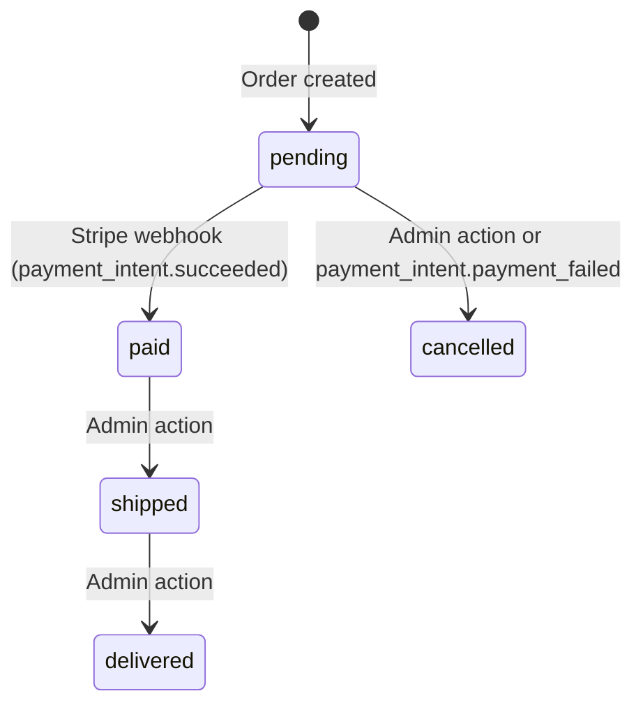
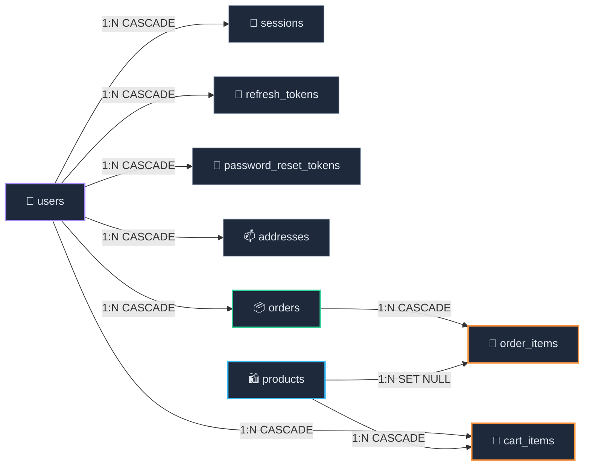

# 🗄️ Database Schema

BLE$$ P uses **PostgreSQL 16** with **Prisma ORM 6.5** for schema management, migrations, and type-safe query execution. All schema changes flow through versioned Prisma migrations, never through manual SQL statements.

## 📑 Table of Contents

- [Entity Relationship Diagram](#-entity-relationship-diagram)
- [Tables](#-tables)
  - [users](#-users)
  - [sessions](#-sessions)
  - [refresh_tokens](#-refresh_tokens)
  - [password_reset_tokens](#-password_reset_tokens)
  - [products](#-products)
  - [product_variants](#-product_variants)
  - [addresses](#-addresses)
  - [orders](#-orders)
  - [order_items](#-order_items)
  - [order_status_history](#-order_status_history)
  - [cart_items](#-cart_items)
  - [wishlist_items](#-wishlist_items)
  - [coupons](#-coupons)
  - [reviews](#-reviews)
  - [newsletter_subscriptions](#-newsletter_subscriptions)
  - [loyalty_transactions](#-loyalty_transactions)
  - [stripe_customers](#-stripe_customers)
  - [email_preferences](#-email_preferences)
  - [contact_messages](#-contact_messages)
- [Relationships](#-relationships)
- [Indexes](#-indexes)
- [Design Decisions](#-design-decisions)
- [Migration Strategy](#-migration-strategy)
- [Seed Data](#-seed-data)

## 📊 Entity Relationship Diagram

```mermaid
erDiagram
    users {
        UUID id PK
        VARCHAR email UK "normalized lowercase"
        VARCHAR password_hash "Argon2id"
        VARCHAR first_name
        VARCHAR last_name
        BOOLEAN is_admin "default false"
        INTEGER loyalty_points "default 0"
        TIMESTAMPTZ created_at
        TIMESTAMPTZ updated_at
        TIMESTAMPTZ deleted_at "soft delete"
    }

    sessions {
        UUID id PK
        UUID user_id FK
        VARCHAR token UK
        TIMESTAMPTZ expires_at
        TIMESTAMPTZ created_at
    }

    refresh_tokens {
        UUID id PK
        UUID user_id FK
        VARCHAR token UK
        UUID family_id "reuse detection"
        TIMESTAMPTZ used_at "null = valid"
        TIMESTAMPTZ expires_at
        TIMESTAMPTZ created_at
    }

    password_reset_tokens {
        UUID id PK
        UUID user_id FK
        VARCHAR token UK
        TIMESTAMPTZ expires_at
        TIMESTAMPTZ used_at
        TIMESTAMPTZ created_at
    }

    products {
        UUID id PK
        VARCHAR name
        INTEGER price "cents"
        TEXT description
        TEXT details
        VARCHAR picture
        VARCHAR_ARRAY images
        VARCHAR category
        VARCHAR_ARRAY colors
        VARCHAR_ARRAY sizes
        BOOLEAN is_active "default true"
        INTEGER onfront_order "featured sort"
        TIMESTAMPTZ created_at
        TIMESTAMPTZ updated_at
        TIMESTAMPTZ deleted_at "soft delete"
    }

    addresses {
        UUID id PK
        UUID user_id FK
        VARCHAR first_name
        VARCHAR last_name
        VARCHAR phone
        VARCHAR address_line_1
        VARCHAR address_line_2
        VARCHAR city
        VARCHAR postal_code
        VARCHAR province
        VARCHAR country
        VARCHAR address_type "shipping or billing"
        BOOLEAN is_default
        TIMESTAMPTZ created_at
        TIMESTAMPTZ updated_at
    }

    orders {
        UUID id PK
        UUID user_id FK
        INTEGER total_cents "cents"
        INTEGER discount_cents "cents"
        VARCHAR coupon_code
        VARCHAR status "pending paid shipped delivered cancelled"
        VARCHAR transaction_key UK "Stripe PaymentIntent ID"
        JSONB shipping_address "point-in-time snapshot"
        TIMESTAMPTZ created_at
        TIMESTAMPTZ updated_at
    }

    order_items {
        UUID id PK
        UUID order_id FK
        UUID product_id FK "nullable, SET NULL"
        VARCHAR product_key "preserved original ID"
        VARCHAR product_name "denormalized"
        INTEGER quantity
        INTEGER unit_price_cents "cents, denormalized"
        VARCHAR size
        VARCHAR color
    }

    cart_items {
        UUID id PK
        UUID user_id FK
        UUID product_id FK
        INTEGER quantity "default 1"
        VARCHAR size
        VARCHAR color
        TIMESTAMPTZ created_at
    }

    product_variants {
        UUID id PK
        UUID product_id FK
        VARCHAR size
        VARCHAR color
        INTEGER stock "default 0"
        VARCHAR sku "optional"
    }

    wishlist_items {
        UUID id PK
        UUID user_id FK
        UUID product_id FK
        TIMESTAMPTZ created_at
    }

    coupons {
        UUID id PK
        VARCHAR code UK
        VARCHAR discount_type "percentage or fixed"
        INTEGER discount_value
        INTEGER min_order_cents "optional"
        INTEGER max_uses "optional"
        INTEGER current_uses "default 0"
        BOOLEAN is_active "default true"
        TIMESTAMPTZ expires_at "optional"
        TIMESTAMPTZ created_at
    }

    reviews {
        UUID id PK
        UUID user_id FK
        UUID product_id FK
        INTEGER rating "1 to 5"
        VARCHAR title "optional"
        TEXT comment "optional"
        TIMESTAMPTZ created_at
        TIMESTAMPTZ updated_at
    }

    newsletter_subscriptions {
        UUID id PK
        VARCHAR email UK
        BOOLEAN is_active "default true"
        TIMESTAMPTZ created_at
    }

    loyalty_transactions {
        UUID id PK
        UUID user_id FK
        INTEGER points "positive or negative"
        VARCHAR type "earned redeemed bonus"
        VARCHAR description
        UUID order_id "optional"
        TIMESTAMPTZ created_at
    }

    stripe_customers {
        UUID id PK
        UUID user_id FK UK
        VARCHAR stripe_customer_id UK
        TIMESTAMPTZ created_at
    }

    email_preferences {
        UUID id PK
        UUID user_id FK UK
        BOOLEAN order_updates "default true"
        BOOLEAN promotions "default true"
        BOOLEAN newsletter "default true"
        BOOLEAN loyalty_alerts "default true"
        TIMESTAMPTZ created_at
        TIMESTAMPTZ updated_at
    }

    contact_messages {
        UUID id PK
        VARCHAR name
        VARCHAR email
        VARCHAR subject
        TEXT message
        TIMESTAMPTZ read_at "optional"
        TIMESTAMPTZ created_at
    }

    order_status_history {
        UUID id PK
        UUID order_id FK
        VARCHAR status
        VARCHAR note "optional"
        TIMESTAMPTZ created_at
    }

    users ||--o{ sessions : "has"
    users ||--o{ refresh_tokens : "has"
    users ||--o{ password_reset_tokens : "has"
    users ||--o{ addresses : "has"
    users ||--o{ orders : "places"
    users ||--o{ cart_items : "owns"
    users ||--o{ wishlist_items : "has"
    users ||--o{ reviews : "writes"
    users ||--o{ loyalty_transactions : "earns"
    users ||--o| stripe_customers : "has"
    users ||--o| email_preferences : "has"
    products ||--o{ cart_items : "in cart"
    products ||--o{ wishlist_items : "wishlisted"
    products ||--o{ reviews : "reviewed"
    products ||--o{ product_variants : "has variants"
    products ||--o{ order_items : "ordered (SET NULL)"
    orders ||--o{ order_items : "contains"
    orders ||--o{ order_status_history : "tracks"
```

## 📋 Tables

### 👤 users

Stores registered user accounts. Supports **soft deletion** via the `deleted_at` column, meaning deleted users are never physically removed from the database.

| Column | Type | Nullable | Default | Constraints | Description |
|--------|------|----------|---------|-------------|-------------|
| `id` | `UUID` | No | `uuid_generate_v4()` | **Primary Key** | Unique user identifier |
| `email` | `VARCHAR` | No | | **Unique** | User's email address (normalized to lowercase) |
| `password_hash` | `VARCHAR` | No | | | Argon2id hash of the user's password |
| `first_name` | `VARCHAR` | No | | | User's first name |
| `last_name` | `VARCHAR` | No | | | User's last name |
| `is_admin` | `BOOLEAN` | No | `false` | | Grants admin privileges when `true` |
| `loyalty_points` | `INTEGER` | No | `0` | | Accumulated loyalty points balance (earned from orders, redeemed for store credit) |
| `created_at` | `TIMESTAMPTZ` | No | `now()` | | Account creation timestamp |
| `updated_at` | `TIMESTAMPTZ` | No | Auto-updated | | Last modification timestamp (Prisma `@updatedAt`) |
| `deleted_at` | `TIMESTAMPTZ` | Yes | `null` | | 🗑️ Soft delete marker. Non-null means the user is deleted |

**Why soft deletes?** Preserving user records is essential for maintaining referential integrity with orders and payment history. Soft deletion also enables account recovery if a user requests reactivation.

### 🔐 sessions

Stores active user sessions. Each session is tied to exactly one user and contains a unique token used for session validation.

| Column | Type | Nullable | Default | Constraints | Description |
|--------|------|----------|---------|-------------|-------------|
| `id` | `UUID` | No | `uuid_generate_v4()` | **Primary Key** | Unique session identifier |
| `user_id` | `UUID` | No | | **FK** → `users.id` (CASCADE) | Owning user |
| `token` | `VARCHAR` | No | | **Unique** | Session token value |
| `expires_at` | `TIMESTAMPTZ` | No | | | Session expiration timestamp |
| `created_at` | `TIMESTAMPTZ` | No | `now()` | | Session creation timestamp |

**On delete behavior:** When a user is deleted, all their sessions are automatically removed via `CASCADE`.

**Indexes:**

| Index | Column(s) | Purpose |
|-------|-----------|---------|
| `sessions_token_key` | `token` | ⚡ Fast token lookup during session validation |
| `sessions_user_id_idx` | `user_id` | ⚡ Retrieve all sessions for a given user |

### 🔄 refresh_tokens

Stores refresh tokens with **family-based tracking** for rotation and reuse detection. Every refresh token belongs to a "family" that traces back to the original login event. When a token is used, a new one is issued in the same family and the old one is marked as consumed.

| Column | Type | Nullable | Default | Constraints | Description |
|--------|------|----------|---------|-------------|-------------|
| `id` | `UUID` | No | `uuid_generate_v4()` | **Primary Key** | Unique token record identifier |
| `user_id` | `UUID` | No | | **FK** → `users.id` (CASCADE) | Owning user |
| `token` | `VARCHAR` | No | | **Unique** | Signed JWT refresh token |
| `family_id` | `UUID` | No | | | Groups tokens from the same login session |
| `used_at` | `TIMESTAMPTZ` | Yes | `null` | | Timestamp when the token was consumed. `null` means it is still valid |
| `expires_at` | `TIMESTAMPTZ` | No | | | Token expiration (default 7 days) |
| `created_at` | `TIMESTAMPTZ` | No | `now()` | | Record creation timestamp |

**🛡️ Reuse detection:** If a token with a non-null `used_at` is submitted again, the entire family (all tokens sharing the same `family_id`) is revoked. This forces the attacker (and the legitimate user) to re-authenticate.

**Indexes:**

| Index | Column(s) | Purpose |
|-------|-----------|---------|
| `refresh_tokens_token_key` | `token` | ⚡ Fast token lookup during refresh |
| `refresh_tokens_family_id_idx` | `family_id` | ⚡ Revoke all tokens in a family on reuse detection |
| `refresh_tokens_user_id_idx` | `user_id` | ⚡ Find all refresh tokens for a user (logout all sessions) |

### 🔑 password_reset_tokens

Stores one-time-use password reset tokens. Each token is tied to a user and has an expiration window.

| Column | Type | Nullable | Default | Constraints | Description |
|--------|------|----------|---------|-------------|-------------|
| `id` | `UUID` | No | `uuid_generate_v4()` | **Primary Key** | Unique record identifier |
| `user_id` | `UUID` | No | | **FK** → `users.id` (CASCADE) | User who requested the reset |
| `token` | `VARCHAR` | No | | **Unique** | Cryptographically random reset token |
| `expires_at` | `TIMESTAMPTZ` | No | | | Token expiration timestamp |
| `used_at` | `TIMESTAMPTZ` | Yes | `null` | | Timestamp when the token was consumed |
| `created_at` | `TIMESTAMPTZ` | No | `now()` | | Record creation timestamp |

**Indexes:**

| Index | Column(s) | Purpose |
|-------|-----------|---------|
| `password_reset_tokens_token_key` | `token` | ⚡ Fast token lookup when the user clicks the reset link |
| `password_reset_tokens_user_id_idx` | `user_id` | ⚡ Find pending reset tokens for a user |

### 🛍️ products

Stores the product catalog. Prices are stored as **integers in cents** to avoid floating-point precision issues. Supports soft deletion, array columns for multi-value attributes, and a featured ordering system.

| Column | Type | Nullable | Default | Constraints | Description |
|--------|------|----------|---------|-------------|-------------|
| `id` | `UUID` | No | `uuid_generate_v4()` | **Primary Key** | Unique product identifier |
| `name` | `VARCHAR` | No | | | Product display name |
| `price` | `INTEGER` | No | | | 💰 Price in cents (e.g., `8999` = $89.99) |
| `description` | `TEXT` | Yes | | | Short marketing description |
| `details` | `TEXT` | Yes | | | Detailed product information (materials, care instructions) |
| `picture` | `VARCHAR` | Yes | | | URL of the main product image |
| `images` | `VARCHAR[]` | No | `[]` | | Array of additional image URLs |
| `category` | `VARCHAR` | Yes | | | Product category (`hoodies`, `pants`, `sets`) |
| `colors` | `VARCHAR[]` | No | `[]` | | Array of available color options |
| `sizes` | `VARCHAR[]` | No | `[]` | | Array of available size options |
| `is_active` | `BOOLEAN` | No | `true` | | Controls product visibility in the storefront |
| `onfront_order` | `INTEGER` | Yes | `null` | | Featured product sort position on the homepage. `null` means not featured |
| `created_at` | `TIMESTAMPTZ` | No | `now()` | | Product creation timestamp |
| `updated_at` | `TIMESTAMPTZ` | No | Auto-updated | | Last modification timestamp |
| `deleted_at` | `TIMESTAMPTZ` | Yes | `null` | | 🗑️ Soft delete marker |

**Why array columns?** PostgreSQL's native `VARCHAR[]` type avoids the need for join tables (e.g., `product_colors`, `product_sizes`). For a small, fixed set of values per product, arrays are simpler and more performant than normalized tables.

**Indexes:**

| Index | Column(s) | Purpose |
|-------|-----------|---------|
| `products_is_active_idx` | `is_active` | ⚡ Filter active products for storefront queries |
| `products_onfront_order_idx` | `onfront_order` | ⚡ Sort featured products on the homepage |
| `products_category_idx` | `category` | ⚡ Filter products by category |

### 📫 addresses

Stores user shipping and billing addresses. Each user can have multiple addresses, with one optionally marked as the default.

| Column | Type | Nullable | Default | Constraints | Description |
|--------|------|----------|---------|-------------|-------------|
| `id` | `UUID` | No | `uuid_generate_v4()` | **Primary Key** | Unique address identifier |
| `user_id` | `UUID` | No | | **FK** → `users.id` (CASCADE) | Owning user |
| `first_name` | `VARCHAR` | No | | | Recipient first name |
| `last_name` | `VARCHAR` | No | | | Recipient last name |
| `phone` | `VARCHAR` | Yes | | | Contact phone number |
| `address_line_1` | `VARCHAR` | No | | | Street address, P.O. box, etc. |
| `address_line_2` | `VARCHAR` | Yes | | | Apartment, suite, unit, building, floor |
| `city` | `VARCHAR` | No | | | City or locality |
| `postal_code` | `VARCHAR` | No | | | Postal or ZIP code |
| `province` | `VARCHAR` | Yes | | | State, province, or region |
| `country` | `VARCHAR` | No | | | Country name |
| `address_type` | `VARCHAR` | No | `shipping` | | Address purpose: `shipping` or `billing` |
| `is_default` | `BOOLEAN` | No | `false` | | Whether this is the user's default address |
| `created_at` | `TIMESTAMPTZ` | No | `now()` | | Record creation timestamp |
| `updated_at` | `TIMESTAMPTZ` | No | Auto-updated | | Last modification timestamp |

**Indexes:**

| Index | Column(s) | Purpose |
|-------|-----------|---------|
| `addresses_user_id_idx` | `user_id` | ⚡ Retrieve all addresses for a given user |

### 📦 orders

Stores customer orders. Totals are stored in cents. The `shipping_address` column holds a **JSONB snapshot** of the address at purchase time, ensuring the record remains accurate even if the user later modifies or deletes their address.

| Column | Type | Nullable | Default | Constraints | Description |
|--------|------|----------|---------|-------------|-------------|
| `id` | `UUID` | No | `uuid_generate_v4()` | **Primary Key** | Unique order identifier |
| `user_id` | `UUID` | No | | **FK** → `users.id` (CASCADE) | Customer who placed the order |
| `total_cents` | `INTEGER` | No | | | 💰 Order total in cents |
| `status` | `VARCHAR` | No | `pending` | | Order lifecycle state |
| `transaction_key` | `VARCHAR` | Yes | | **Unique** | Stripe PaymentIntent ID (links the order to Stripe) |
| `shipping_address` | `JSONB` | Yes | | | 📋 Address snapshot at time of purchase |
| `created_at` | `TIMESTAMPTZ` | No | `now()` | | Order creation timestamp |
| `updated_at` | `TIMESTAMPTZ` | No | Auto-updated | | Last status change timestamp |

**📋 Order status lifecycle:**



| Status | Meaning |
|--------|---------|
| `pending` | Order created, awaiting payment |
| `paid` | Payment confirmed via Stripe webhook |
| `shipped` | Order dispatched to the customer |
| `delivered` | Order received by the customer |
| `cancelled` | Order cancelled (before or after payment) |

**📋 Shipping address JSONB structure:**

```json
{
  "firstName": "Alice",
  "lastName": "Martin",
  "phone": "+1-555-0123",
  "addressLine1": "42 Rue de la Paix",
  "addressLine2": "Apt 3B",
  "city": "Paris",
  "postalCode": "75002",
  "province": null,
  "country": "France"
}
```

**Indexes:**

| Index | Column(s) | Purpose |
|-------|-----------|---------|
| `orders_user_id_idx` | `user_id` | ⚡ Retrieve all orders for a given user |
| `orders_status_idx` | `status` | ⚡ Filter orders by status (admin dashboard, reporting) |

### 📝 order_items

Stores individual line items within an order. Product name and unit price are **denormalized** (copied from the products table at purchase time) so that historical orders remain accurate when product details change or products are deleted.

| Column | Type | Nullable | Default | Constraints | Description |
|--------|------|----------|---------|-------------|-------------|
| `id` | `UUID` | No | `uuid_generate_v4()` | **Primary Key** | Unique line item identifier |
| `order_id` | `UUID` | No | | **FK** → `orders.id` (CASCADE) | Parent order |
| `product_id` | `UUID` | Yes | | **FK** → `products.id` (SET NULL) | Reference to the current product. Set to `null` if the product is deleted |
| `product_key` | `VARCHAR` | No | | | Original product ID at time of purchase (preserved even if the product is deleted) |
| `product_name` | `VARCHAR` | No | | | Product name at time of purchase |
| `quantity` | `INTEGER` | No | | | Number of units ordered |
| `unit_price_cents` | `INTEGER` | No | | | 💰 Unit price in cents at time of purchase |
| `size` | `VARCHAR` | Yes | | | Selected size variant |
| `color` | `VARCHAR` | Yes | | | Selected color variant |

**Why denormalize?** If a product's price changes from $89.99 to $99.99, existing orders must still show the original $89.99 price. The `product_name` and `unit_price_cents` columns capture a point-in-time snapshot. The `product_key` preserves the original product ID even after `product_id` is set to `null` by a `SET NULL` cascade.

**Why SET NULL on delete?** Unlike other foreign keys that use `CASCADE`, order items use `SET NULL` when a product is deleted. This preserves the order history while breaking the live reference to the deleted product.

**Indexes:**

| Index | Column(s) | Purpose |
|-------|-----------|---------|
| `order_items_order_id_idx` | `order_id` | ⚡ Fetch all line items for a given order |

### 🛒 cart_items

Stores items in a user's shopping cart. A **composite unique constraint** on `(user_id, product_id, size, color)` prevents duplicate entries for the same product variant.

| Column | Type | Nullable | Default | Constraints | Description |
|--------|------|----------|---------|-------------|-------------|
| `id` | `UUID` | No | `uuid_generate_v4()` | **Primary Key** | Unique cart item identifier |
| `user_id` | `UUID` | No | | **FK** → `users.id` (CASCADE) | Cart owner |
| `product_id` | `UUID` | No | | **FK** → `products.id` (CASCADE) | Product in the cart |
| `quantity` | `INTEGER` | No | `1` | | Number of units |
| `size` | `VARCHAR` | Yes | | | Selected size variant |
| `color` | `VARCHAR` | Yes | | | Selected color variant |
| `created_at` | `TIMESTAMPTZ` | No | `now()` | | When the item was added to the cart |

**Unique constraint:** `(user_id, product_id, size, color)`

This means a user can have the same product in their cart multiple times **only** if the size or color differs. Adding an identical variant increments the `quantity` instead of creating a duplicate row.

**Indexes:**

| Index | Column(s) | Purpose |
|-------|-----------|---------|
| `cart_items_user_id_idx` | `user_id` | ⚡ Fetch the entire cart for a user |

## 🔗 Relationships

All foreign keys enforce referential integrity at the database level. The `ON DELETE` behavior varies by relationship.

| Parent Table | Child Table | Cardinality | On Delete | Rationale |
|--------------|-------------|-------------|-----------|-----------|
| `users` | `sessions` | One → Many | `CASCADE` | Sessions are meaningless without the user |
| `users` | `refresh_tokens` | One → Many | `CASCADE` | Tokens are meaningless without the user |
| `users` | `password_reset_tokens` | One → Many | `CASCADE` | Reset tokens are meaningless without the user |
| `users` | `addresses` | One → Many | `CASCADE` | Addresses belong exclusively to the user |
| `users` | `orders` | One → Many | `CASCADE` | Orders are tied to the customer |
| `users` | `cart_items` | One → Many | `CASCADE` | Cart items belong exclusively to the user |
| `products` | `cart_items` | One → Many | `CASCADE` | If a product is removed, clear it from all carts |
| `products` | `order_items` | One → Many | `SET NULL` | Preserve order history; set `product_id` to null |
| `orders` | `order_items` | One → Many | `CASCADE` | Line items are part of the order |

### 🔗 Relationship Diagram (simplified)



## 📇 Indexes

Every index in the schema exists for a specific performance reason. The table below consolidates all indexes across the database.

| Table | Index Name | Column(s) | Type | Justification |
|-------|-----------|-----------|------|---------------|
| `users` | `users_email_key` | `email` | Unique | 🔍 Login lookup, duplicate email prevention |
| `sessions` | `sessions_token_key` | `token` | Unique | 🔍 Session validation on every authenticated request |
| `sessions` | `sessions_user_id_idx` | `user_id` | B-tree | 🔍 List/revoke user sessions |
| `refresh_tokens` | `refresh_tokens_token_key` | `token` | Unique | 🔍 Token refresh lookup |
| `refresh_tokens` | `refresh_tokens_family_id_idx` | `family_id` | B-tree | 🔍 Family-wide revocation on reuse detection |
| `refresh_tokens` | `refresh_tokens_user_id_idx` | `user_id` | B-tree | 🔍 Logout all sessions for a user |
| `password_reset_tokens` | `password_reset_tokens_token_key` | `token` | Unique | 🔍 Reset token validation |
| `password_reset_tokens` | `password_reset_tokens_user_id_idx` | `user_id` | B-tree | 🔍 Find pending resets for a user |
| `products` | `products_is_active_idx` | `is_active` | B-tree | 🔍 Filter active products in storefront queries |
| `products` | `products_onfront_order_idx` | `onfront_order` | B-tree | 🔍 Sort featured products on homepage |
| `products` | `products_category_idx` | `category` | B-tree | 🔍 Category filtering in product listing |
| `addresses` | `addresses_user_id_idx` | `user_id` | B-tree | 🔍 Retrieve user addresses at checkout |
| `orders` | `orders_user_id_idx` | `user_id` | B-tree | 🔍 Order history for a customer |
| `orders` | `orders_status_idx` | `status` | B-tree | 🔍 Filter by status in admin dashboard |
| `orders` | `orders_transaction_key_key` | `transaction_key` | Unique | 🔍 Stripe webhook lookup by PaymentIntent ID |
| `order_items` | `order_items_order_id_idx` | `order_id` | B-tree | 🔍 Fetch line items for an order |
| `cart_items` | `cart_items_user_id_idx` | `user_id` | B-tree | 🔍 Load entire cart for a user |
| `cart_items` | `cart_items_user_id_product_id_size_color_key` | `user_id, product_id, size, color` | Unique | 🔍 Prevent duplicate variants in the cart |

## 🧠 Design Decisions

### 💰 Prices in Cents

All monetary values (`price`, `total_cents`, `unit_price_cents`) are stored as **integers representing cents**. This avoids IEEE 754 floating-point precision issues that plague currency calculations.

```
Database value:  8999    (integer)
Display value:   $89.99  (formatted by the frontend)
```

The frontend divides by 100 and applies locale-appropriate formatting. No floating-point arithmetic ever touches the money path.

### 🗑️ Soft Deletes

The `users` and `products` tables implement soft deletion through a nullable `deleted_at` column. When a record is "deleted," the column is set to the current timestamp instead of physically removing the row.

**All queries must exclude soft-deleted records by default.** The repository layer appends `WHERE deleted_at IS NULL` to every read query unless explicitly requested otherwise (e.g., admin recovery tools).

Why this matters:
- **Users:** Preserves order history and payment records. A hard-deleted user would orphan their orders.
- **Products:** Preserves order item references. The `SET NULL` cascade on `order_items.product_id` handles the FK, but soft deletion keeps the product data available for admin review.

### 📋 Order Item Denormalization

The `order_items` table stores `product_name` and `unit_price_cents` as independent columns copied from the product at purchase time. This is intentional denormalization.

**Why?** Products are mutable. Prices change, names get updated, products get discontinued. An order placed six months ago must display the exact name and price the customer paid, not the current values.

### 🏠 Shipping Address as JSONB Snapshot

The `orders.shipping_address` column stores the full address as a JSONB object rather than referencing the `addresses` table via a foreign key.

**Why?** Addresses are mutable. A customer might update their home address after placing an order. The order must retain the exact address it was shipped to, not the customer's current address. Storing a JSONB snapshot captures this point-in-time state.

### 👪 Refresh Token Families

The `family_id` column in `refresh_tokens` groups all tokens that originate from a single login event. When a refresh token is used:

1. The old token is marked as consumed (`used_at` is set)
2. A new token is issued in the same family
3. If a consumed token is resubmitted, **every token in the family is revoked**

This mechanism detects token theft. If an attacker steals a refresh token and uses it before the legitimate user, the legitimate user's next refresh attempt triggers family-wide revocation, alerting the system to a potential compromise.

### 🎨 Array Columns for Product Variants

Product `images`, `colors`, and `sizes` use PostgreSQL's native `VARCHAR[]` array type instead of separate join tables.

**Trade-offs:**
- ✅ Simpler queries (no JOINs needed to fetch a product with its variants)
- ✅ Fewer tables to manage
- ✅ Atomic reads and writes (the entire array is stored in a single column)
- ⚠️ Cannot create foreign key constraints on array elements
- ⚠️ Not suitable for attributes that need their own metadata (e.g., if colors needed hex codes, a join table would be more appropriate)

For BLE$$ P's current product model (simple string lists), arrays are the pragmatic choice.

## 🔄 Migration Strategy

All schema changes are managed exclusively through **Prisma migrations**. Direct SQL modifications to any environment are forbidden.

### Workflow


### Rules

| Rule | Rationale |
|------|-----------|
| Never edit an applied migration | Applied migrations are immutable history. Create a new migration to amend |
| Review generated SQL before committing | Prisma's generated SQL should be verified for correctness and efficiency |
| Use multi-step migrations for destructive changes | Add the new structure → backfill data → remove the old structure (in separate migrations) |
| Test migrations against production-like data | Schema changes that work on an empty database may fail on real data with constraints |
| Migration failures in CI block deployment | A broken migration must never reach production |

### Common Commands

```bash
# 🔧 Development: generate and apply a new migration
npx prisma migrate dev --name add_phone_to_addresses

# 🚀 Production: apply all pending migrations
npx prisma migrate deploy

# 📊 Check migration status
npx prisma migrate status

# 🔄 Reset the development database (destructive!)
npx prisma migrate reset

# 🔍 Generate Prisma Client without running migrations
npx prisma generate
```

## 🌱 Seed Data

The seed script (`prisma/seed.ts`) populates the database with initial data for development and testing. It is **idempotent**: running it multiple times will not create duplicate records.

### 👤 Admin User

| Field | Value |
|-------|-------|
| Email | `admin@blessp.com` |
| Password | `Admin123456!` |
| First Name | `Admin` |
| Last Name | `Blessp` |
| Role | Admin (`is_admin: true`) |

The password is hashed with Argon2id (64 MB memory, 3 time iterations, 4 parallelism) before storage.

### 🛍️ Products (7 items)

| # | Name | Price | Category | Colors | Featured Order |
|---|------|-------|----------|--------|----------------|
| 1 | Classic Black Hoodie | $89.99 | `hoodies` | Black | 1st |
| 2 | Ocean Blue Hoodie | $89.99 | `hoodies` | Blue | 2nd |
| 3 | Rose Pink Hoodie | $89.99 | `hoodies` | Pink | 3rd |
| 4 | Essential Blue Pants | $69.99 | `pants` | Blue | (not featured) |
| 5 | Black Hoodie & Pants Set | $149.99 | `sets` | Black | 4th |
| 6 | Blue Hoodie & Pants Set | $149.99 | `sets` | Blue | (not featured) |
| 7 | Pink Hoodie & Pants Set | $149.99 | `sets` | Pink | (not featured) |

All products share these attributes:
- **Sizes:** S, M, L, XL
- **Material:** 100% heavyweight organic cotton
- **Images:** Each product has 1 to 3 image URLs

### Running the Seed

```bash
# Via Prisma CLI
cd server && npx prisma db seed

# Via tsx directly
cd server && npx tsx prisma/seed.ts
```

The seed uses `upsert` for the admin user and a `findFirst` + `create/update` pattern for products, ensuring safe re-execution on an already-seeded database.
